<h1 align="center">
  Proyecto 2 <br>
  EL-3313 Taller de Digitales <br>
  Ahorcado: juego electrónico FPGA / PC por enlace serial
</h1>

<h3 align="center" style="color: #0366d6; letter-spacing: 1px;">
  Equipo de trabajo
</h3>

<p align="center">
  <b>Fallas Fallas Mariana | 2022080686 | mfallas@estudiantec.cr </b>
  <br>
  <b>Garita Serrano Justin | 2022437433 | jugarita@estudiantec.cr </b>
  <br>
  <b>López Méndez Abner | 2022273075 | ablopez@estudiantec.cr </b>
  <br>
  <b>Segura Chinchilla Jordi | 2022240646 | jorsegura@estudiantec.cr </b>
</p>

---

Vídeo para la defensa: https://youtu.be/WKnffdmOIWA

---

# Documento de diseño

Este documento reúne el diseño del sistema siguiendo la metodología de diseño modular: primero se explica el problema y lo que hubo que investigar, después la solución estimada y sus objetivos, y luego el hardware por niveles, desde el bloque general hasta cada módulo. Al final están las interfaces, la temporización, la aplicación de PC y el plan de pruebas.

La documentación detallada de cada subsistema está en la carpeta `DOCUMENTATION` del diseño (`nucleo-juego_DOCUMENTATION.md`, `LCD_DOCUMENTATION.md`, `UART_DOCUMENTATION.md` y `PERIFERICOS_LOCALES_DOCUMENTATION.md`) y en `PYTHON/DOCUMENTATION`. Aquí se junta todo en un solo lugar.

## Contenido

1. [Comprensión del problema](#1-comprensión-del-problema)
2. [Investigación](#2-investigación)
3. [Estimación de la solución](#3-estimación-de-la-solución)
4. [Objetivos de la solución](#4-objetivos-de-la-solución)
5. [Diagrama de primer nivel](#5-diagrama-de-primer-nivel)
6. [Diagrama de segundo nivel](#6-diagrama-de-segundo-nivel)
7. [Diagrama de tercer nivel](#7-diagrama-de-tercer-nivel)
8. [Diagrama de cuarto nivel](#8-diagrama-de-cuarto-nivel)
9. [Quinto nivel: integración y conexiones](#9-quinto-nivel-integración-y-conexiones)
10. [Interfaces de los periféricos y protocolo](#10-interfaces-de-los-periféricos-y-protocolo)
11. [Temporización](#11-temporización)
12. [Aplicación de PC y generador de la ROM](#12-aplicación-de-pc-y-generador-de-la-rom)
13. [Estrategia de implementación y plan de pruebas](#13-estrategia-de-implementación-y-plan-de-pruebas)
14. [Referencias](#referencias)

---

## 1. Comprensión del problema

Hay que construir el juego del ahorcado con toda la lógica dentro de una FPGA Nexys 4. La computadora solo funciona como terminal: el jugador escribe una letra en una aplicación de Python, la letra viaja por el puerto serie, y la FPGA decide qué pasa y le devuelve el estado de la partida.

Lo primero que dejamos claro fue qué le toca a cada lado:

| En la FPGA | En la PC |
|---|---|
| Banco de palabras en ROM | Pedir una letra al jugador |
| Selección pseudoaleatoria de la palabra con un LFSR | Validar que sea una sola letra A–Z antes de enviarla |
| Validación de la letra y revelado de las posiciones | Mostrar el patrón, los intentos y el resultado |
| Conteo de errores y del tiempo | — |
| Decisión de quién gana | — |
| LCD, displays, LEDs y sonido | — |

Las reglas de la partida son:

- como máximo seis letras incorrectas; la sexta pierde aunque quede tiempo;
- una letra ya jugada, buena o mala, se ignora: no gasta intento ni reinicia el tiempo;
- si la letra aparece varias veces, se revelan todas sus apariciones a la vez;
- se gana cuando no queda ninguna posición oculta;
- al terminar se muestra el resultado al menos 3 s y el sistema vuelve solo a la selección de modo;
- el botón central reinicia todo en cualquier momento, incluido el contador de victorias.

Antes de cada partida se elige la dificultad en el LCD con dos botones: uno alterna la opción mostrada y el otro la confirma.

| | Fácil | Difícil |
|---|---|---|
| Palabras posibles | cualquiera del banco (4 letras o más) | solo las de 6 letras o más |
| Tiempo de partida | 60 s | 45 s |

Escogimos 60 s y 45 s porque son los valores sugeridos y mantienen al modo difícil con menos tiempo; además los dos caben en dos dígitos del display.

Del lado del hardware las condiciones son un único reloj de 100 MHz, RTL sintetizable en SystemVerilog, un LCD PmodCLP de 16x2 manejado por un periférico propio con registros de 32 bits, un periférico UART a 115200 baudios construido sobre un núcleo TX/RX que entregó el curso, displays de 7 segmentos, LEDs y retroalimentación sonora.

Un caso que hubo que decidir: si llega una letra por el serial mientras se está en la pantalla de selección o mostrando el resultado, **se ignora**. El aviso de dato recibido se limpia igual, para que esa letra no quede guardada y aparezca como la primera jugada de la siguiente partida.

---

## 2. Investigación

Solo investigamos lo que era nuevo para el equipo. Lo que ya se había visto en el curso (FSM, contadores, decodificadores, el LFSR del Proyecto 1) se retomó sin volver a estudiarlo desde cero.

| Tema | Qué necesitábamos saber | Dónde se usó |
|---|---|---|
| LCD HD44780 y PmodCLP | Secuencia de inicialización, códigos de instrucción, tiempos de espera, conexión de J1 y J2. El PmodCLP usa un controlador Samsung KS0066, compatible con el HD44780 | `lcd_controller` |
| Protocolo UART | Trama 8N1, relación entre reloj y baudios, sobremuestreo en el receptor | `uart_core`, `uart_peripheral` |
| Periféricos mapeados a memoria | Cómo exponer un periférico con registros de 32 bits, lectura combinacional, bits de solo escritura y de limpieza | `lcd_peripheral`, `uart_peripheral` |
| ROM sintetizable con cadenas | Cómo guardar palabras de largo variable en palabras de ancho fijo | `word_rom`, `gen_word_rom.py` |
| LFSR descrito en HDL | Polinomio primitivo de grado 8 y cómo usar su valor como índice | `lfsr`, `game_controller` |
| Temporizador regresivo | Cuenta de segundos con una habilitación de 1 ms y despliegue en displays multiplexados | `round_timer`, `display_controller` |
| Rebotes y metaestabilidad | Sincronizador de dos etapas y filtro de rebotes por contador | `button_input` |
| Salida de audio de la Nexys 4 | La tarjeta no tiene zumbador: tiene un amplificador (`AUD_PWM`, `AUD_SD`) con salida al jack de 3,5 mm | `buzzer_controller` |

Lo más importante que salió de esta etapa:

- El manual del PmodCLP pide 20 ms tras encender, 37 µs entre instrucciones y 1,52 ms después de `Clear Display`. No da el ancho del pulso `E` ni los tiempos de establecimiento de `RS` y los datos, así que esos los fijamos nosotros con margen amplio.
- El núcleo UART del curso (`UART_tx.vhd`, `UART_rx.vhd`) usa sobremuestreo ×16 en recepción, así que el divisor del receptor es la dieciseisava parte del del transmisor.
- En la Nexys 4 los pulsadores y los LEDs son activos en alto y los segmentos y ánodos de los displays son activos en bajo. El botón `CPU_RESET` es activo en bajo y no se usa.

---

## 3. Estimación de la solución

Después de discutir el problema llegamos a una partición en cuatro bloques dentro de la FPGA:

1. **Núcleo del juego:** todas las reglas. No maneja ningún periférico directamente.
2. **Subsistema UART:** todo lo que entra y sale por el serial.
3. **Subsistema LCD:** todo lo que se escribe en la pantalla.
4. **Periféricos locales:** base de tiempo, botones, displays, LEDs y sonido.

Las ideas que guiaron la solución fueron estas:

- **Un solo reloj y habilitaciones.** Todo lo lento sale de un pulso de 1 ms (`tick`) o de contadores propios sobre el reloj de 100 MHz. No hay relojes derivados.
- **Capas de presentación entre el juego y los periféricos.** Pintar una pantalla son 34 escrituras al LCD y un mensaje serie son hasta 34 bytes. Si eso lo hiciera la máquina de estados del juego, pasaría de una docena de estados a varias decenas y mezclaría reglas con armado de texto. Por eso existen `lcd_screen_ctrl` y `uart_msg`: el juego solo dice "muestra esta pantalla" o "notifica este evento".
- **Un solo maestro por periférico.** Cada periférico tiene un único módulo que escribe en sus registros. Así nunca hay dos bloques usando el mismo bus al mismo tiempo.
- **ROM ordenada por dificultad.** Con 64 palabras, las primeras 32 largas y las últimas 32 cortas, el índice se saca truncando el LFSR y el modo difícil nunca puede elegir una palabra corta.
- **Tiempos como parámetros.** Todas las constantes de tiempo bajan desde `top`, así los testbenches pueden usar valores reducidos sin tocar el RTL.

---

## 4. Objetivos de la solución

| # | Objetivo | Cómo se comprueba |
|---|---|---|
| O1 | Banco de 64 palabras distintas, solo A–Z, de 4 a 11 letras; índices 0–31 con 6 letras o más y 32–63 con 4 o 5 | `gen_word_rom.py` y `tb_word_rom` |
| O2 | LFSR de 8 bits que recorra 255 estados distintos sin pasar por cero | `tb_lfsr` |
| O3 | En modo difícil, ninguno de los 255 valores del LFSR produce una palabra de menos de 6 letras | por construcción (índice de 5 bits) y `tb_word_rom` |
| O4 | Cuenta regresiva de 60 s en fácil y 45 s en difícil, con segundos de exactamente 1000 ticks de 1 ms | `tb_round_timer` |
| O5 | Máximo 6 errores, revelado simultáneo, letras repetidas sin penalización, prioridad victoria → sexto error → tiempo | `tb_game_controller` |
| O6 | Pantalla de resultado visible al menos 3 s, contados desde que termina de dibujarse | `tb_game_controller`, prueba en tarjeta |
| O7 | Enlace UART a 115200 baudios con error de divisor menor a 0,5 % en TX y RX | cálculo de la sección 11 y prueba en tarjeta |
| O8 | Periférico LCD con registros CONTROL/ESTADO (0x00) y DATOS (0x04), `busy` y `done` | `tb_lcd_peripheral`, `tb_lcd_controller` |
| O9 | Filtro de rebotes de 10 ms en los tres botones | `tb_button_input` |
| O10 | Multiplexado de 4 dígitos a 250 Hz | `tb_display_controller` |
| O11 | Cuatro sonidos distinguibles: acierto, error, victoria y derrota | `tb_buzzer_controller`, prueba en tarjeta |
| O12 | Diseño sin latches y con timing cerrado a 100 MHz | reportes de síntesis e implementación de Vivado |

---

## 5. Diagrama de primer nivel

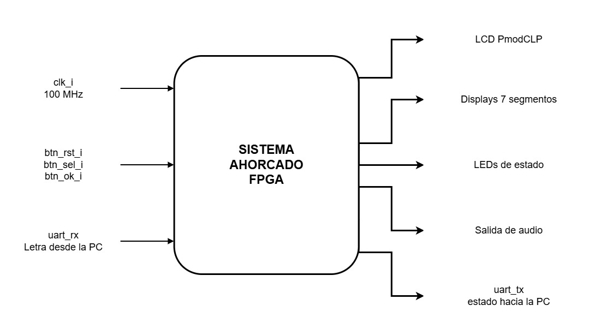

**Objetivo.** Jugar una partida completa de ahorcado: mostrar la selección de dificultad, elegir la palabra, recibir letras desde la PC, validarlas, llevar el tiempo y los intentos, informar el estado por el serial y mostrarlo en la tarjeta.

**Entradas**

| Señal | Descripción |
|---|---|
| `clk_i` | Reloj del sistema, 100 MHz (pin E3) |
| `btn_rst_i` | Botón central (BTNC). Reinicia el sistema y el contador de victorias |
| `btn_sel_i` | Botón izquierdo (BTNL). Alterna la dificultad mostrada |
| `btn_ok_i` | Botón derecho (BTNR). Confirma la dificultad e inicia la partida |
| `uart_rx_i` | Línea serie a 115200 baudios, 8N1. Trae la letra que envía la PC |

**Salidas**

| Señal | Descripción |
|---|---|
| `lcd_db_o[7:0]`, `lcd_rs_o`, `lcd_rw_o`, `lcd_e_o` | LCD PmodCLP 16x2. `lcd_rw_o` queda fijo en 0 |
| `seg_o[6:0]`, `an_o[7:0]` | Displays de 7 segmentos: dos dígitos de tiempo y dos de victorias |
| `led_o[15:0]` | LED0 a LED2 indican la etapa del juego y LED15 el modo difícil |
| `aud_pwm_o`, `aud_sd_o` | Audio hacia el jack de 3,5 mm |
| `uart_tx_o` | Líneas de texto con el estado de la partida hacia la PC |

**Explicación general.** El sistema es completamente síncrono con un solo reloj de 100 MHz. Los botones llegan sin relación con el reloj y con rebotes, así que pasan por sincronización y filtrado antes de usarse. El reinicio es síncrono y activo en alto. El arranque no depende de pulsar nada: los registros tienen valor inicial declarado (se carga desde el bitstream) y el LCD hace solo su inicialización. La PC queda fuera del sistema: solo envía letras y muestra lo que la FPGA le devuelve.

---

## 6. Diagrama de segundo nivel

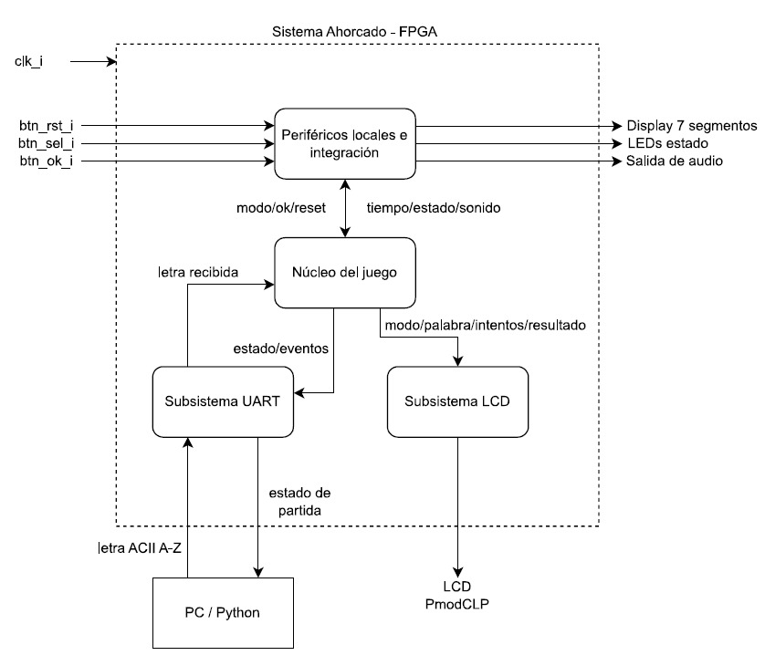

El bloque general se divide en cuatro bloques internos, más dos elementos externos: la aplicación de PC y el LCD.

### 6.1 Periféricos locales e integración

- **Objetivo:** conectar el sistema con las entradas y salidas físicas de la tarjeta y generar la base de tiempo común.
- **Entradas:** `clk_i`, `btn_rst_i`, `btn_sel_i`, `btn_ok_i`; desde el núcleo, el tiempo restante, las victorias, la etapa del juego, el modo y los eventos de sonido.
- **Salidas:** hacia el núcleo, el reinicio y los pulsos de los botones; hacia la tarjeta, `seg_o`, `an_o`, `led_o`, `aud_pwm_o` y `aud_sd_o`; hacia todo el sistema, el `tick` de 1 ms.
- **Explicación general:** genera un pulso cada milisegundo dividiendo los 100 MHz entre 100 000. Cada botón pasa por un sincronizador, un filtro de 10 ms y un detector de flanco. Del lado de las salidas multiplexa los cuatro dígitos, enciende el LED de la etapa y genera los tonos. Ninguna de estas salidas le devuelve información al juego, así que el juego publica y sigue.

### 6.2 Núcleo del juego

- **Objetivo:** implementar todas las reglas del ahorcado.
- **Entradas:** reinicio y pulsos de los botones, la letra ya validada desde el subsistema UART y la señal de ocupado de las dos capas de presentación.
- **Salidas:** hacia el LCD, la pantalla pedida y los datos de la partida; hacia el UART, el evento a notificar y los mismos datos; hacia los periféricos locales, el tiempo, las victorias, la etapa, el modo y los eventos de sonido.
- **Explicación general:** contiene la máquina de estados del juego, la ROM de 64 palabras, el LFSR y el temporizador. Al confirmar el modo captura el LFSR y elige la palabra. Con cada letra decide si es repetida, acertada o fallada, y luego revisa el desenlace. Como no maneja ningún bus, pide pantallas y mensajes y espera a que las capas queden libres.

### 6.3 Subsistema UART

- **Objetivo:** ser el único maestro del enlace serie en los dos sentidos.
- **Entradas:** `uart_rx_i`; el evento y los datos de la partida desde el núcleo.
- **Salidas:** `uart_tx_o`; la letra recibida, su pulso de validez y la señal de ocupado hacia el núcleo.
- **Explicación general:** en transmisión convierte un evento en líneas de texto de ancho fijo y las envía byte a byte. En recepción revisa el aviso de byte nuevo, lee el dato, limpia el aviso y descarta todo lo que no sea una letra mayúscula. La transmisión y la recepción están en el mismo bloque porque comparten el mismo bus de registros.

### 6.4 Subsistema LCD

- **Objetivo:** mostrar el estado del juego en el PmodCLP.
- **Entradas:** la pantalla pedida, el pulso de redibujado y los datos de la partida.
- **Salidas:** `lcd_db_o`, `lcd_rs_o`, `lcd_rw_o`, `lcd_e_o`; la señal de ocupado hacia el núcleo.
- **Explicación general:** convierte "muestra esta pantalla" en 34 transacciones al LCD, cada una con su inicio, su espera y su fin, respetando los tiempos del controlador. Cada línea se escribe completa (16 caracteres, rellenando con espacios), así que no hace falta borrar la pantalla antes de redibujar y no hay parpadeo.

### 6.5 Elementos externos

- **PC / Python:** pide una letra, valida que sea un único carácter A–Z y la envía como un byte. Recibe las líneas de estado y las muestra. No guarda la palabra ni decide nada del juego.
- **LCD PmodCLP:** módulo 16x2 con controlador KS0066, conectado en paralelo de 8 bits al conector JA (datos) y a la fila inferior del JB (control).

### 6.6 Funcionamiento del sistema en conjunto

Al programar la FPGA el LCD se inicializa solo y el núcleo pide la pantalla de selección. El botón izquierdo cambia el modo y provoca un redibujado; el derecho captura el LFSR y se elige la palabra dentro del rango que corresponde al modo.

Al empezar la partida el núcleo arranca el temporizador, pide la pantalla de juego y el mensaje de inicio, y espera a que ambas capas terminen. Desde ahí el ciclo es siempre igual: llega una letra filtrada, el núcleo la evalúa, pide el redibujado y la notificación, espera, y vuelve a esperar letra. Mientras tanto los displays muestran el tiempo y las victorias, el LED indica la etapa y suena el tono que corresponda.

El temporizador no se detiene mientras se publica una jugada; si se detuviera, cada letra le regalaría unos milisegundos al jugador. Si el tiempo se acaba mientras se está escribiendo el LCD o enviando una línea, el aviso se queda activo y se atiende cuando las dos capas terminan, para no dejar una pantalla ni una trama a medias.

La partida termina por victoria, sexto error o tiempo agotado. Los tres casos pasan por el mismo estado final y solo se diferencian en un código de dos bits. Después de 3 s de resultado, contados desde que la pantalla quedó dibujada, el sistema vuelve solo a la selección.

---

## 7. Diagrama de tercer nivel

El tercer nivel descompone cada bloque del segundo nivel en sus módulos. Se presenta un diagrama por bloque.

### 7.1 Núcleo del juego

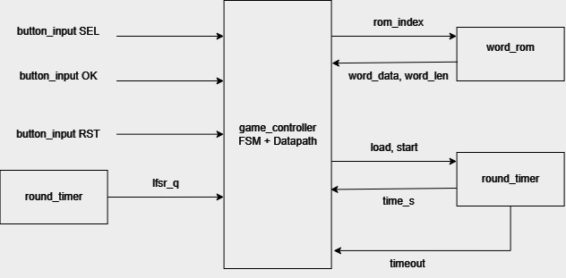

| Módulo | Objetivo | Entradas | Salidas |
|---|---|---|---|
| `game_controller` | FSM y camino de datos del juego | pulsos de botones, `lfsr_i`, palabra y longitud de la ROM, `timer_timeout_i`, letra recibida, `busy` de las capas | índice de ROM, control del temporizador, pantalla y evento a publicar, datos de la partida, sonido, etapa, victorias |
| `word_rom` | Banco de 64 palabras | `index_i` | `word_data_o`, `word_len_o` |
| `lfsr` | Secuencia pseudoaleatoria de 8 bits | `clk_i`, `rst_i` | `lfsr_o` |
| `round_timer` | Cuenta regresiva en segundos | `tick_i`, `load_i`, `seconds_i`, `run_i` | `time_s_o`, `timeout_o` |

`game_controller` es el centro: le pone el índice a la ROM y registra la palabra, captura el LFSR al confirmar y carga y habilita el temporizador. El vencimiento del temporizador regresa como condición de transición.

### 7.2 Subsistema UART

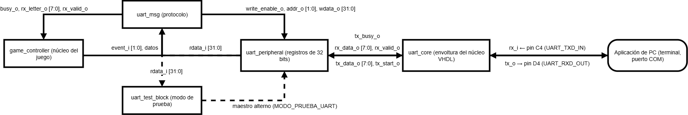

| Módulo | Objetivo | Entradas | Salidas |
|---|---|---|---|
| `uart_msg` | Capa de protocolo: arma las líneas de texto y filtra las letras | evento, pulso de envío y datos de la partida; `rdata_i` del periférico | `busy_o`, `rx_letter_o`, `rx_valid_o`; `write_enable_o`, `addr_o`, `wdata_o` |
| `uart_peripheral` | Banco de registros de 32 bits del enlace | interfaz estándar; `tx_busy_i`, `rx_data_i`, `rx_valid_i` | `rdata_o`; `tx_data_o`, `tx_start_o` |
| `uart_core` | Envoltura del núcleo VHDL del curso | `rx_i`; `tx_data_i`, `tx_start_i` | `tx_o`; `tx_busy_o`, `rx_data_o`, `rx_valid_o` |
| `uart_test_block` | Bloque de pruebas del periférico (se activa por parámetro) | `tick_i`, `rdata_i` | interfaz estándar, `ultimo_rx_o` |

Los tres primeros forman una cadena: el evento del juego se vuelve texto en `uart_msg`, escrituras de registro en `uart_peripheral` y bits en `uart_core`. En modo de prueba, `uart_test_block` toma el lugar de `uart_msg` como maestro.

### 7.3 Subsistema LCD


| Módulo | Objetivo | Entradas | Salidas |
|---|---|---|---|
| `lcd_screen_ctrl` | Convertir una pantalla en 34 transacciones | `screen_i`, `redraw_i`, datos de la partida, `rdata_i` | `busy_o`, `write_enable_o`, `addr_o`, `wdata_o` |
| `lcd_peripheral` | Registros CONTROL/ESTADO y DATOS | interfaz estándar; `busy_i`, `done_i` | `rdata_o`; `start_o`, `rs_o`, `data_o` |
| `lcd_controller` | Señales físicas y tiempos del HD44780 | `tick_i`, `start_i`, `rs_i`, `data_i` | `busy_o`, `done_o`; `lcd_db_o`, `lcd_rs_o`, `lcd_rw_o`, `lcd_e_o` |

La cadena es `game_controller → lcd_screen_ctrl → lcd_peripheral → lcd_controller → PmodCLP`. El juego no conoce los tiempos del LCD y el controlador físico no sabe cómo se arma el texto.

### 7.4 Periféricos locales

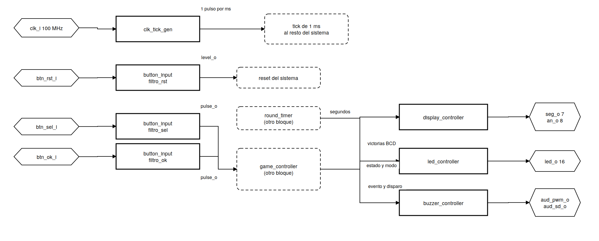

| Módulo | Objetivo | Entradas | Salidas |
|---|---|---|---|
| `clk_tick_gen` | Pulso de 1 ms | `clk_i`, `rst_i` | `tick_o` |
| `button_input` ×3 | Sincronizar y filtrar un pulsador | `clk_i`, `rst_i`, `tick_i`, `btn_i` | `pulse_o`, `level_o` |
| `display_controller` | Multiplexar cuatro dígitos | `tick_i`, `time_s_i`, `wins_bcd_i` | `seg_o`, `an_o` |
| `led_controller` | Mostrar etapa y modo | `state_i`, `mode_i` | `led_o` |
| `buzzer_controller` | Generar los tonos | `tick_i`, `snd_event_i`, `snd_start_i` | `aud_pwm_o`, `aud_sd_o`, `busy_o` |

### 7.5 Funcionamiento del sistema en conjunto

`clk_tick_gen` marca el paso de casi todo el sistema. Los tres `button_input` son la única forma en que el jugador actúa sobre la tarjeta: el central reinicia y los otros dos le llegan a `game_controller` como pulsos. `game_controller` usa `word_rom`, `lfsr` y `round_timer` para llevar la partida, y publica lo que pasa hacia dos cadenas de tres niveles (LCD y UART), que le devuelven su señal de ocupado. En sentido contrario, `uart_msg` le entrega las letras ya validadas. Las tres salidas locales solo reciben datos: displays, LEDs y sonido nunca hacen esperar al juego.

---

## 8. Diagrama de cuarto nivel

Para cada módulo se presentan los puntos a) a h) del diseño modular. Los puntos i) y j), esquemático por compuertas y conexiones por chips, no aplican tal cual porque el sistema se implementa en una FPGA y no con integrados en protoboard. En su lugar se incluye la estructura interna de cada módulo (registros, contadores, comparadores y multiplexores) y, en la sección 9, la asignación de pines, que es lo que se escribe en el archivo de restricciones.

### 8.1 `clk_tick_gen`

**a) Nombre.** `clk_tick_gen.sv`, instancia `base_tiempo`.

**b) Diagrama modular.**

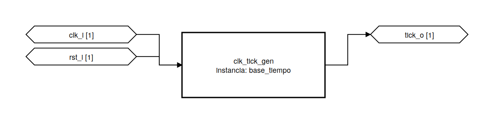

**c) Objetivo.** Generar un pulso de un ciclo cada milisegundo, para medir tiempo sin un segundo reloj.

**d) Entradas.** `clk_i` (100 MHz), `rst_i` (síncrono, activo en alto). Parámetro `TICK_CYCLES = 100 000`.

**e) Salidas.** `tick_o`: un ciclo en alto cada 1 ms.

**f) Relación con otros módulos.** Alimenta a los tres filtros de botón, al temporizador, al control del juego, al controlador del LCD, al multiplexado de displays, al buzzer y al bloque de pruebas del UART. En `top` recibe un cero fijo en el reinicio, porque el reinicio sale de un filtro que a su vez necesita este tick.

**g) Funcionamiento.** Un contador sube en cada flanco; al llegar a 99 999, `tick_o` se pone en alto ese ciclo y el contador vuelve a cero.

**h) Diseño.**

```
100 000 000 ciclos/s / 1000 = 100 000 ciclos por ms
ceil(log2(100 000)) = 17 bits
```

| Contador | `tick_o` | Siguiente |
|---|---|---|
| `rst_i` activo | 0 | 0 |
| 0 a 99 998 | 0 | +1 |
| 99 999 | 1 | 0 |

- El periodo es exacto (100 000 × 10 ns = 1 ms), lo que importa porque de aquí salen los 60 s de la partida.
- La salida es el comparador directo, sin registrar, para no atrasar un ciclo a todos los consumidores.
- `tick_o` es una habilitación, no un reloj: se conecta a la lógica y no a entradas de reloj, así todo queda en un solo dominio.

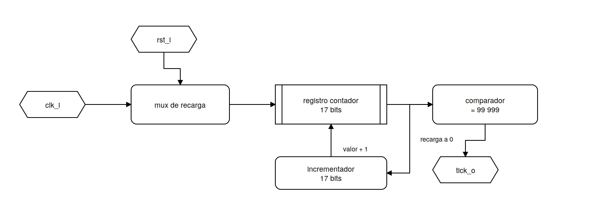

---

### 8.2 `button_input`

**a) Nombre.** `button_input.sv`, tres instancias: `filtro_rst`, `filtro_sel`, `filtro_ok`.

**b) Diagrama modular.**

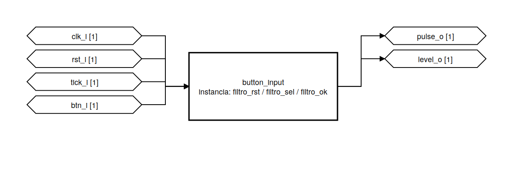

**c) Objetivo.** Convertir un pulsador mecánico, asíncrono y con rebotes, en un nivel limpio y un pulso de un ciclo.

**d) Entradas.** `clk_i`, `rst_i`, `tick_i`, `btn_i`. Parámetros `DEBOUNCE_MS = 10` y `BTN_ACTIVE_LEVEL = 1`.

**e) Salidas.** `pulse_o` (un ciclo al presionar) y `level_o` (nivel filtrado).

**f) Relación con otros módulos.**

| Instancia | Botón | Pin | Salida usada | Destino |
|---|---|---|---|---|
| `filtro_rst` | BTNC | E16 | `level_o` | reinicio de todo el sistema |
| `filtro_sel` | BTNL | T16 | `pulse_o` | `game_controller`, cambia el modo |
| `filtro_ok` | BTNR | R10 | `pulse_o` | `game_controller`, confirma |

El reinicio se usa como nivel para que el sistema se mantenga reiniciado mientras el botón está presionado; los otros dos como pulso para que una pulsación larga no cuente muchas veces.

**g) Funcionamiento.** La entrada pasa por cuatro etapas: normalización de polaridad, sincronizador de dos flip-flops, filtro de rebotes y detector de flanco.

**h) Diseño.**

| Comparación | Condición | Contador | Nivel estable |
|---|---|---|---|
| sincronizada = estable | — | 0 | sin cambio |
| distintas | `tick_i` y cuenta < 9 | +1 | sin cambio |
| distintas | `tick_i` y cuenta = 9 | 0 | adopta el nuevo |
| distintas | sin `tick_i` | sin cambio | sin cambio |

- El contador cuenta ticks y no ciclos: bastan 4 bits en vez de 20.
- Cada rebote devuelve el contador a cero; solo un nivel sostenido 10 ticks cambia el estado.
- Como la pulsación no cae alineada con los ticks, el filtro tarda entre 9 y 10 ms en adoptar el nivel.
- Sin el detector de flanco, el juego vería el botón presionado millones de ciclos y el modo cambiaría sin parar.

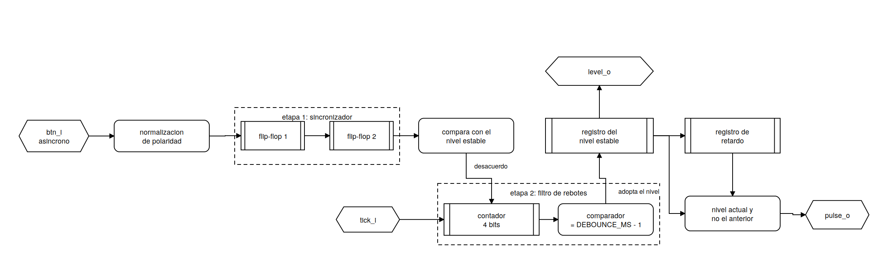

---

### 8.3 `lfsr`

**a) Nombre.** `lfsr.sv`, instancia `generador`.

**b) Diagrama modular.**

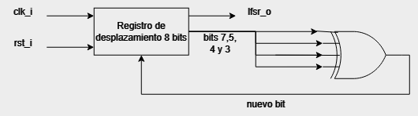

**c) Objetivo.** Producir una secuencia pseudoaleatoria de 8 bits para elegir la palabra de cada partida.

**d) Entradas.** `clk_i`, `rst_i` (recarga la semilla `8'b0000_0001`).

**e) Salidas.** `lfsr_o[7:0]`.

**f) Relación con otros módulos.** `game_controller` captura su valor en el ciclo en que llega el pulso de confirmación y usa 5 o 6 de sus bits según el modo.

**g) Funcionamiento.** Corre libre: en cada flanco se desplaza a la izquierda y entra por la derecha el XOR de cuatro bits.

```systemverilog
lfsr_q <= {lfsr_q[6:0], lfsr_q[7] ^ lfsr_q[5] ^ lfsr_q[4] ^ lfsr_q[3]};
```

**h) Diseño.** Polinomio primitivo `x^8 + x^6 + x^5 + x^4 + 1`, que da el ciclo máximo de 2^8 − 1 = 255 estados. Como el registro se indexa desde cero, el tap `x^i` está en `lfsr_q[i-1]`.

| Ancho | Ciclo | Costo |
|---|---|---|
| 6 bits | 63 estados | 6 flip-flops |
| 8 bits | 255 estados | 8 flip-flops |

Se usan 8 bits porque el costo extra son dos flip-flops y el ciclo es cuatro veces más largo. Que corra libre hace que la palabra dependa del instante en que se presiona el botón; si solo avanzara al empezar la partida, después de cada encendido saldría siempre la misma secuencia.

---

### 8.4 `word_rom`

**a) Nombre.** `word_rom.sv`, instancia `banco`. Se genera con `PYTHON/DESIGN/gen_word_rom.py`.

**b) Diagrama modular.**

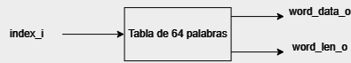

**c) Objetivo.** Entregar, para un índice, la palabra en ASCII y su longitud.

**d) Entradas.** `index_i[5:0]`. Es combinacional, sin reloj.

**e) Salidas.** `word_data_o[95:0]` (12 caracteres, rellenos con espacios) y `word_len_o[3:0]`.

**f) Relación con otros módulos.** Solo la usa `game_controller`, que registra las dos salidas al cargar la partida. Desde ahí se juega con la copia registrada.

**g) Funcionamiento.** Es una tabla: cada índice tiene una palabra fija. El primer carácter queda en los bits más altos:

```
word_data_o[8*(11-i) +: 8]   ->  carácter i
bits 95..88 = carácter 0 ... bits 7..0 = carácter 11
```

**h) Diseño.**

| Índices | Longitud | Modos |
|---|---|---|
| 0 a 31 | 6 a 11 letras | Fácil y Difícil |
| 32 a 63 | 4 o 5 letras | solo Fácil |

El orden de la tabla es lo que garantiza el modo difícil: en ese modo el índice tiene el bit 5 en cero, así que nunca puede llegar a las palabras cortas. Por eso la ROM se genera con un script que revisa el orden cada vez (sección 12.2). El `default` del `case` entrega una palabra vacía para que no se infiera un latch. Ocupa 6 400 bits en lógica distribuida y ningún registro.

---

### 8.5 `round_timer`

**a) Nombre.** `round_timer.sv`, instancia `temporizador`.

**b) Diagrama modular.**

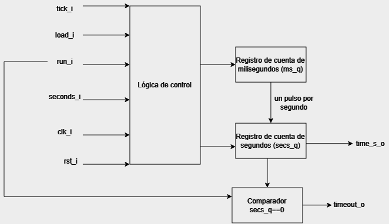

**c) Objetivo.** Llevar la cuenta regresiva de la partida y avisar cuando llega a cero.

**d) Entradas.** `clk_i`, `rst_i`, `tick_i`, `load_i` (pulso de carga), `seconds_i[6:0]`, `run_i` (habilita la cuenta).

**e) Salidas.** `time_s_o[6:0]` (segundos restantes) y `timeout_o` (nivel).

**f) Relación con otros módulos.** Lo controla `game_controller`, que lo carga con 60 o 45 s y lo detiene en los estados de resultado. `time_s_o` va al juego y a `display_controller`.

**g) Funcionamiento.** Son dos contadores encadenados: uno acumula 1000 ticks y el otro baja un segundo cada vez que el primero se completa, hasta llegar a cero y quedarse ahí.

**h) Diseño.**

| Condición | `ms_q` | `secs_q` | `timeout_o` |
|---|---|---|---|
| `rst_i` | 0 | 0 | 0 |
| `load_i` | 0 | `seconds_i` | 0 |
| `run_i`, `tick_i`, `ms_q` < 999 | +1 | igual | 0 |
| `run_i`, `tick_i`, `ms_q` = 999, `secs_q` > 0 | 0 | −1 | 0 |
| `run_i`, `tick_i`, `ms_q` = 999, `secs_q` = 0 | 0 | 0 | 1 |
| `run_i` = 0 | igual | igual | 0 |

- La carga tiene prioridad sobre la cuenta y limpia el acumulador, así el primer segundo dura completo.
- La resta solo ocurre si `secs_q` no es cero; sin esa condición el registro daría la vuelta a 127.
- `timeout_o` es un nivel y no un pulso, para que el juego lo atienda aunque esté ocupado publicando.
- Acumulador de 10 bits (`$clog2(1000)`) y contador de segundos de 7 bits, con margen sobre 60.

---

### 8.6 `game_controller`

**a) Nombre.** `game_controller.sv`, instancia `juego`.

**b) Diagrama modular.**

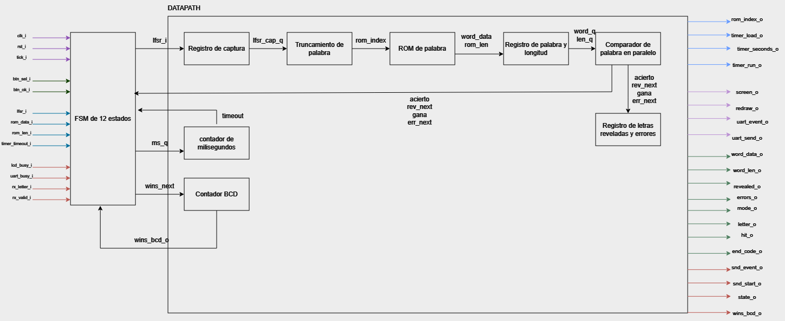

**c) Objetivo.** Aplicar las reglas: elegir la palabra, evaluar las letras, contar errores, resolver el desenlace y llevar las victorias, sin escribir directamente en ningún periférico.

**d) Entradas.**

| Señal | Ancho | Descripción |
|---|---|---|
| `clk_i`, `rst_i`, `tick_i` | 1 | reloj, reinicio y tick de 1 ms |
| `btn_sel_i`, `btn_ok_i` | 1 | pulsos de los botones |
| `lfsr_i` | 8 | valor del LFSR |
| `rom_data_i`, `rom_len_i` | 96, 4 | palabra y longitud |
| `timer_timeout_i` | 1 | tiempo agotado (nivel) |
| `rx_letter_i`, `rx_valid_i` | 8, 1 | letra validada y su pulso |
| `lcd_busy_i`, `uart_busy_i` | 1 | capas de presentación ocupadas |

**e) Salidas.**

| Señal | Ancho | Descripción |
|---|---|---|
| `rom_index_o` | 6 | índice de la palabra |
| `timer_load_o`, `timer_seconds_o`, `timer_run_o` | 1, 7, 1 | control del temporizador |
| `screen_o`, `redraw_o` | 3, 1 | pantalla pedida y pulso de redibujado |
| `uart_event_o`, `uart_send_o` | 2, 1 | evento (0 inicio, 1 letra, 2 repetida, 3 fin) y pulso |
| `word_data_o`, `word_len_o`, `revealed_o` | 96, 4, 12 | palabra, longitud y posiciones reveladas |
| `errors_o` | 3 | errores cometidos (0 a 6) |
| `mode_o` | 1 | 0 fácil, 1 difícil |
| `letter_o`, `hit_o` | 8, 1 | última letra evaluada y si acertó |
| `end_code_o` | 2 | 0 victoria, 1 derrota por fallos, 2 derrota por tiempo |
| `snd_event_o`, `snd_start_o` | 3, 1 | sonido y su disparo |
| `state_o` | 2 | 00 selección, 01 partida, 10 resultado |
| `wins_bcd_o` | 8 | victorias en BCD |

**f) Relación con otros módulos.**

| Módulo | Qué intercambian |
|---|---|
| `word_rom` | le da el índice y registra la palabra |
| `lfsr` | captura su valor al confirmar |
| `round_timer` | lo carga, lo habilita y lee el vencimiento |
| `lcd_screen_ctrl` | le pide una pantalla y espera `busy` en 0 |
| `uart_msg` | le pide un evento, espera, y recibe las letras |
| `buzzer_controller` | le dispara un sonido sin esperar |
| `display_controller`, `led_controller` | les publica victorias, etapa y modo |

**g) Funcionamiento.**

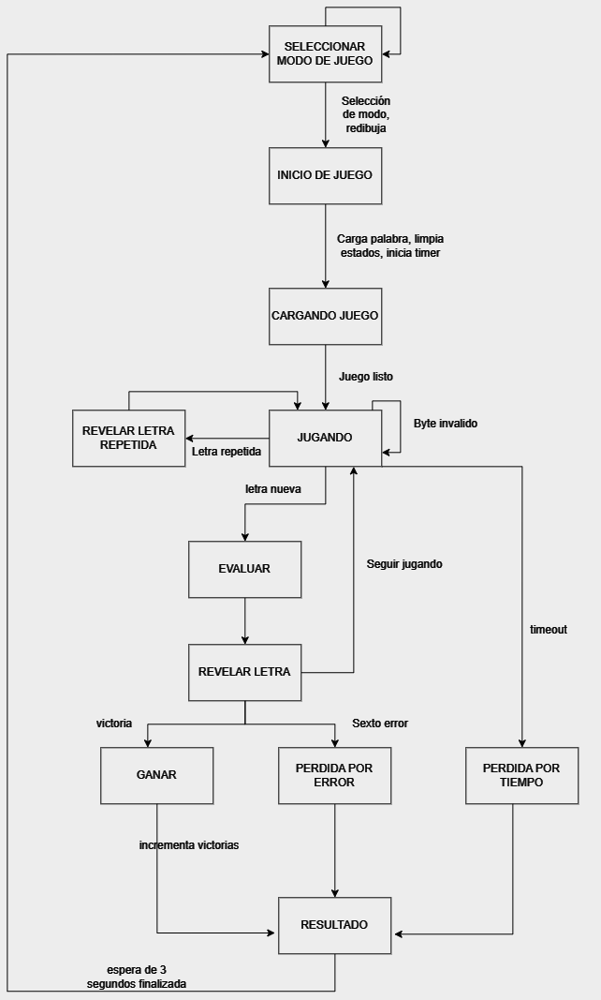

| Estado | Qué hace | Cómo sale |
|---|---|---|
| `S_DIBUJA_SEL` | pide la pantalla de selección | cuando el LCD acepta |
| `S_SELECCION` | `btn_sel_i` alterna el modo y vuelve a dibujar | `btn_ok_i` → `S_CARGA` |
| `S_CARGA` | registra la palabra, limpia reveladas, usadas y errores, carga el temporizador | un ciclo |
| `S_INICIO` | dispara la pantalla y el mensaje de inicio | un ciclo |
| `S_ESPERA_INICIO` | espera | las dos capas libres |
| `S_JUGANDO` | atiende letras o el vencimiento | letra nueva o tiempo agotado |
| `S_EVALUA` | compara la letra, revela y cuenta el error | un ciclo |
| `S_PUBLICA` | dispara lo que corresponde a la jugada | un ciclo |
| `S_ESPERA_JUGADA` | espera y resuelve el desenlace | las dos capas libres |
| `S_FIN` | dispara pantalla, mensaje y sonido de resultado | un ciclo |
| `S_ESPERA_FIN` | espera y arranca la cuenta de 3 s | las dos capas libres |
| `S_RESULTADO` | cuenta 3 s | vuelve a `S_DIBUJA_SEL` |

Una letra repetida se detecta con un registro de 26 bits (índice = letra − `8'h41`). Si ya estaba marcada, no se evalúa, no toca errores, solo se notifica a la PC y el LCD no se redibuja.

**h) Diseño.**

*Selección de la palabra.*

```systemverilog
assign rom_index_o = mode_q ? {1'b0, lfsr_cap_q[4:0]} : lfsr_cap_q;
```

| Modo | Bits | Rango | Palabras |
|---|---|---|---|
| Difícil | `[4:0]` | 0–31 | 6 letras o más |
| Fácil | `[5:0]` | 0–63 | todas |

Un ciclo, sin división ni reintentos. Como el LFSR nunca vale cero, el índice 0 sale un poco menos que los demás (7 de 255 en difícil contra 8 de 255; 3 de 255 en fácil contra 4 de 255), algo que no afecta el juego.

*Evaluación en paralelo.* Para cada posición `c` de las 12:

```
mascara_valida[c] = (c < len_q)
coincide[c]       = (c < len_q) && (caracter[c] == letra_q)
```

| Señal | Expresión | Significado |
|---|---|---|
| `acierto` | OR de `coincide` | la letra está en la palabra |
| `rev_next` | `rev_q` OR `coincide` | reveladas después de la jugada |
| `gana` | `rev_next == mascara_valida` | no queda nada oculto |
| `err_next` | `acierto ? err_q : err_q + 1` | errores después de la jugada |

Sin la máscara, las posiciones de relleno nunca se revelarían y `gana` jamás se cumpliría en palabras de menos de 12 letras. Comparar posición por posición habría costado doce ciclos y un contador; doce comparadores de 8 bits caben sin problema en un ciclo de reloj.

*Resolución de la jugada.*

| Prioridad | Condición | Desenlace | `end_code_o` |
|---|---|---|---|
| 1 | `gana` | victoria | 0 |
| 2 | `err_next == 6` | derrota por fallos | 1 |
| 3 | `timer_timeout_i` | derrota por tiempo | 2 |

La victoria va primero porque una letra que completa la palabra no puede ser un fallo.

*Otras decisiones.*

- **Un solo estado de fin.** Los tres desenlaces hacen lo mismo (pintar, notificar, sonar, esperar); lo que cambia es un dato de dos bits, así que pertenece al camino de datos.
- **`S_CARGA` separado de `S_INICIO`.** Las capas copian los datos en el mismo flanco en que aceptan la orden; si se registrara y disparara en el mismo estado, la primera pantalla mostraría la palabra anterior.
- **Vencimiento diferido.** Como `timeout` es un nivel, si vence mientras se publica, se atiende en `S_ESPERA_JUGADA`.
- **Victorias en BCD con saturación.** Se guardan en decenas y unidades para que el display no tenga que dividir, y se quedan en 99.

---

### 8.7 `lcd_screen_ctrl`

**a) Nombre.** `lcd_screen_ctrl.sv`, instancia `pantalla`. Usa internamente `lcd_screen_snapshot`, `lcd_step_decoder`, `lcd_text_gen` y el paquete `lcd_screen_pkg`.

**b) Diagrama modular.**


**c) Objetivo.** Convertir la orden "muestra esta pantalla" en las transacciones que escriben las dos filas del LCD.

**d) Entradas.** `clk_i`, `rst_i`, `screen_i[2:0]`, `redraw_i`, `word_data_i[95:0]`, `word_len_i[3:0]`, `revealed_i[11:0]`, `errors_i[2:0]`, `mode_i`, `wins_i[7:0]`, `rdata_i[31:0]`.

**e) Salidas.** `busy_o`, `write_enable_o`, `addr_o[1:0]`, `wdata_o[31:0]`.

**f) Relación con otros módulos.** Recibe órdenes y datos de `game_controller` y es el único maestro de `lcd_peripheral`.

**g) Funcionamiento.** Cada pantalla son 34 pasos: posicionar en la fila 0 (`0x80`), 16 caracteres, posicionar en la fila 1 (`0xC0`) y 16 caracteres. Al aceptar la orden, `lcd_screen_snapshot` copia los datos para que la pantalla completa salga con los mismos valores aunque el juego cambie algo a mitad. `lcd_step_decoder` traduce el número de paso en comando, fila y columna, y `lcd_text_gen` da el carácter.

| Código | Pantalla | Fila 0 | Fila 1 |
|---:|---|---|---|
| 0 | `SCR_SELECT` | `AHORCADO  V:nn  ` | `MODO: FACIL     ` / `MODO: DIFICIL   ` |
| 1 | `SCR_PLAY` | patrón, p. ej. `A______         ` | `INTENTOS: 6    F` |
| 2 | `SCR_WIN` | `   GANASTE!     ` | la palabra |
| 3 | `SCR_LOSE_FALLOS` | `PERDISTE: FALLOS` | la palabra |
| 4 | `SCR_LOSE_TIEMPO` | `PERDISTE: TIEMPO` | la palabra |

**h) Diseño.**

| Estado | Condición | Siguiente | Acción |
|---|---|---|---|
| `S_IDLE` | `redraw_i` | `S_LIBRE` | captura datos, paso = 0 |
| `S_LIBRE` | `busy` = 0 | `S_DATOS` | — |
| `S_DATOS` | — | `S_CTRL` | escribe el byte en DATOS |
| `S_CTRL` | — | `S_FIN` | escribe `rs` y `start` en CONTROL |
| `S_FIN` | `done` y paso < 33 | `S_LIBRE` | paso + 1 |
| `S_FIN` | `done` y paso = 33 | `S_IDLE` | termina |

Separarlo en cuatro piezas permite cambiar los textos sin abrir la máquina de estados. La columna se calcula con aritmética de 4 bits, que da la vuelta sola en la columna 15; esto depende de que el LCD tenga 16 columnas.

---

### 8.8 `lcd_peripheral`

**a) Nombre.** `lcd_peripheral.sv`, instancia `periferico_lcd`.

**b) Diagrama modular.** Bloque central del diagrama de la sección 7.3. Su versión preliminar (interfaz de registros + FSM + temporizador) se muestra aquí:


**c) Objetivo.** Presentar el LCD como un periférico de registros de 32 bits.

**d) Entradas.** `clk_i`, `rst_i`, `write_enable_i`, `addr_i[1:0]`, `wdata_i[31:0]`, `busy_i`, `done_i`.

**e) Salidas.** `rdata_o[31:0]`, `start_o`, `rs_o`, `data_o[7:0]`.

**f) Relación con otros módulos.** Su maestro es `lcd_screen_ctrl` y su esclavo es `lcd_controller`.

**g) Funcionamiento.** Las escrituras son síncronas y la lectura es combinacional. Cuando llega una solicitud y el controlador está libre, genera el pulso correspondiente; si está ocupado, la solicitud se descarta. Los códigos de `clear` (`0x01`) y `home` (`0x02`) los pone el propio periférico.

**h) Diseño.** El mapa de registros está en la sección 10.2. Las dos decisiones importantes:

- `done_i` llega como pulso de un ciclo y el periférico lo guarda como bandera hasta que se acepta otra operación. Con un pulso, el maestro podría no verlo nunca y quedarse esperando.
- Si se piden varias cosas a la vez, la prioridad es `clear` > `home` > `start`.

---

### 8.9 `lcd_controller`

**a) Nombre.** `lcd_controller.sv`, instancia `modulo_lcd`.

**b) Diagrama modular.** Bloque derecho del diagrama de la sección 7.3.

**c) Objetivo.** Generar las señales físicas del PmodCLP con los tiempos del HD44780 e inicializar el LCD al encender.

**d) Entradas.** `clk_i`, `rst_i`, `tick_i`, `start_i`, `rs_i`, `data_i[7:0]`.

**e) Salidas.** `busy_o`, `done_o` (pulso), `lcd_db_o[7:0]`, `lcd_rs_o`, `lcd_rw_o` (siempre 0), `lcd_e_o`.

**f) Relación con otros módulos.** Recibe las solicitudes de `lcd_peripheral` y le devuelve `busy_o` y `done_o`. Sus salidas van directo a los pines del Pmod.

**g) Funcionamiento.** Al arrancar espera 50 ms y envía la secuencia de inicialización; mientras tanto `busy_o` está en alto. Después atiende escrituras: datos y `RS` estables, `E` en alto, `E` en bajo (el LCD captura en el flanco de bajada) y espera posterior.

| Paso | Código | Función | Espera |
|---|---|---|---:|
| Function Set | `0x38` | 8 bits, 2 líneas, 5×8 | 60 µs |
| Display On | `0x0C` | pantalla encendida, sin cursor | 60 µs |
| Clear Display | `0x01` | borra | 2 ms |
| Entry Mode | `0x06` | cursor avanza, sin desplazamiento | 60 µs |

**h) Diseño.**

| Estado | Condición | Siguiente |
|---|---|---|
| `S_POWERON` | 50 ms cumplidos | `S_CARGA` |
| `S_CARGA` | — | `S_SETUP` |
| `S_SETUP` | 200 ns | `S_E_ALTO` |
| `S_E_ALTO` | 1 µs | `S_E_BAJO` |
| `S_E_BAJO` | 1 µs | `S_ESPERA` |
| `S_ESPERA` | espera cumplida, faltan pasos de inicio | `S_CARGA` |
| `S_ESPERA` | espera cumplida, inicio terminado | `S_IDLE` |
| `S_IDLE` | `start_i` | `S_CARGA` |


La propuesta original tenía un estado por instrucción de arranque; en la versión final un contador indica qué instrucción toca, y la FSM queda en siete estados.

- **No se lee la bandera de ocupado del LCD.** Leerla obligaría a usar el bus de datos como bidireccional con buffers triestado. Esperar por contador es suficiente.
- **Contadores.** La espera más larga en ciclos es 2 ms = 200 000 ciclos, que necesita `ceil(log2(200 000)) = 18` bits. Los 50 ms de arranque se cuentan con el tick de 1 ms, con un contador de 6 bits.
- **`clear` y `home` usan la espera larga.** El controlador reconoce esos códigos y escoge 2 ms por su cuenta.
- **Tiempos de `E`.** El manual no los da; 200 ns, 1 µs y 1 µs son elección del equipo con margen, y funcionaron en la tarjeta.

---

### 8.10 `uart_msg`

**a) Nombre.** `uart_msg.sv`, instancia `protocolo`. Usa internamente `uart_msg_snapshot.sv` y `uart_msg_char_gen.sv`.

**b) Diagrama modular.**

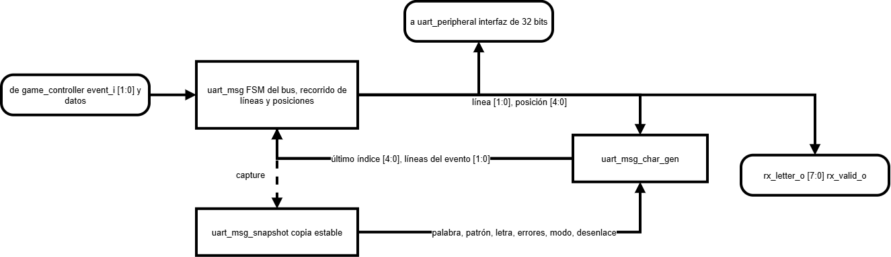

**c) Objetivo.** Convertir un evento del juego en líneas de texto y enviarlas byte a byte; en recepción, entregar solo letras válidas.

**d) Entradas.** `event_i[1:0]`, `send_i`, `letter_i[7:0]`, `hit_i`, `end_code_i[1:0]`, `word_data_i[95:0]`, `word_len_i[3:0]`, `revealed_i[11:0]`, `errors_i[2:0]`, `mode_i`, `rdata_i[31:0]`.

**e) Salidas.** `busy_o`, `rx_letter_o[7:0]`, `rx_valid_o`, `write_enable_o`, `addr_o[1:0]`, `wdata_o[31:0]`.

**f) Relación con otros módulos.** Por arriba con `game_controller`, por abajo es el maestro de `uart_peripheral`.

**g) Funcionamiento.**

| Evento | Líneas que emite |
|---|---|
| 0 inicio | `START:<M>:<LL>`, `PATT:<p>`, `ERR:<n>` |
| 1 letra | `LET:<X>:<R>`, `PATT:<p>`, `ERR:<n>` |
| 2 repetida | `LET:<X>:RPT` |
| 3 fin | `END:<E>:<W>` |

Al aceptar `send_i`, el snapshot copia los datos de la jugada, porque un envío tarda unos milisegundos y el juego podría cambiar algo mientras tanto. Para cada byte: espera `send` = 0, escribe el registro TX, escribe `send` = 1 y espera a que baje. `uart_msg_char_gen` dice qué carácter va en cada posición, cuántas líneas tiene el evento y dónde termina cada una.

En recepción revisa `new_rx`; si está en 1 lee el registro RX, limpia el aviso y, si el byte está entre `0x41` y `0x5A`, da un pulso en `rx_valid_o`. Cualquier otro byte se descarta sin avisar. Una orden de envío que llegue mientras atiende la recepción queda anotada.

**h) Diseño.**

- El fin de cada byte se detecta con el bit `send`, porque en la prueba con TX y RX unidos el receptor avisa antes de que el transmisor suelte la línea.
- La recepción vive aquí y no en el juego para que el periférico tenga un solo maestro.
- `rx_valid_o` dura un ciclo. Si el juego no está en `S_JUGANDO`, la letra se pierde a propósito.
- Recursos: 149 registros (129 del snapshot), FSM de 7 estados, contador de línea de 2 bits y de posición de 5 bits.

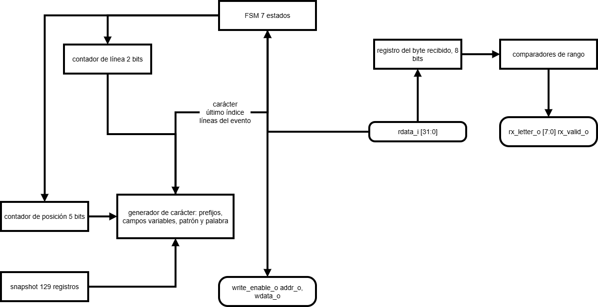

---

### 8.11 `uart_peripheral`

**a) Nombre.** `uart_peripheral.sv`, instancia `periferico_uart`.

**b) Diagrama modular.**

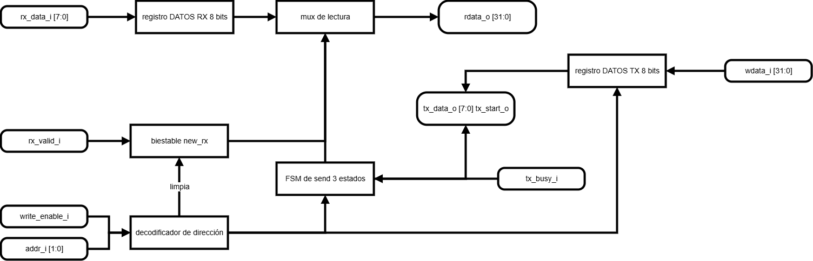

**c) Objetivo.** Exponer el enlace serie como un periférico de registros de 32 bits, sin que transmitir y recibir se estorben.

**d) Entradas.** `clk_i`, `rst_i`, `write_enable_i`, `addr_i[1:0]`, `wdata_i[31:0]`, `tx_busy_i`, `rx_data_i[7:0]`, `rx_valid_i`.

**e) Salidas.** `rdata_o[31:0]`, `tx_data_o[7:0]`, `tx_start_o`.

**f) Relación con otros módulos.** Maestro: `uart_msg` (o `uart_test_block` en modo de prueba). Esclavo: `uart_core`.

**g) Funcionamiento.** La transmisión pasa por `TX_LIBRE`, `TX_ARRANQUE` y `TX_CURSO`. El estado intermedio existe porque el núcleo tarda en levantar su señal de ocupado; sin él, el periférico daría el envío por terminado antes de empezar. El bit `send` que se lee es "estado distinto de `TX_LIBRE`". Al llegar un byte se guarda en el registro RX y se levanta `new_rx`.

**h) Diseño.** El registro de control no es plano: cada bit tiene su propia semántica (tabla en la sección 10.3). Si fuera plano, limpiar `new_rx` podría cancelar un envío, o iniciar un envío podría borrar una letra recién llegada. Si un byte llega en el mismo ciclo en que se limpia el aviso, gana la llegada. La lectura es un multiplexor de 4 entradas con `default` para la dirección `11`. Usa 20 registros.

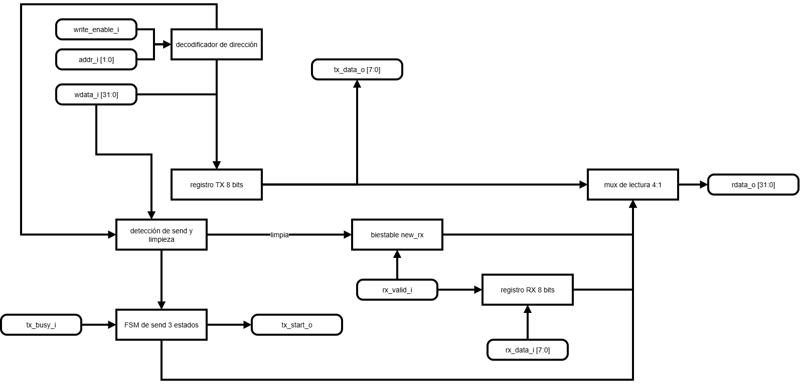

---

### 8.12 `uart_core`

**a) Nombre.** `uart_core.sv`, instancia `nucleo_uart`. Instancia `UART_tx.vhd` y `UART_rx.vhd` del curso sin modificarlos.

**b) Diagrama modular.**

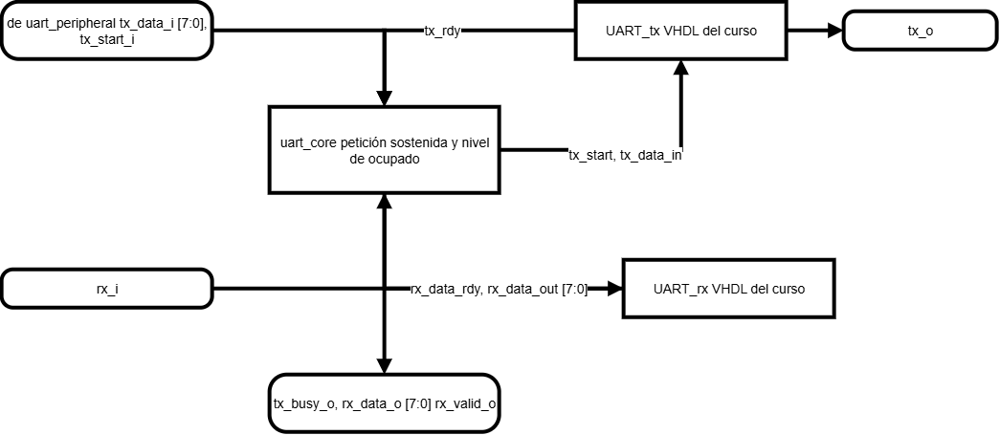

**c) Objetivo.** Adaptar el núcleo VHDL a la interfaz que espera `uart_peripheral`.

**d) Entradas.** `clk_i`, `rst_i`, `rx_i` (pin C4), `tx_data_i[7:0]`, `tx_start_i`. Parámetros `BAUD_DIV = 868` y `BAUD_X16_DIV = 54`.

**e) Salidas.** `tx_o` (pin D4), `tx_busy_o`, `rx_data_o[7:0]`, `rx_valid_o`.

**f) Relación con otros módulos.** Solo habla con `uart_peripheral` y con los pines del puerto USB-serie. Los nombres de la tarjeta (`UART_TXD_IN`, `UART_RXD_OUT`) están desde el punto de vista de la PC.

**g) Funcionamiento.** Resuelve dos diferencias entre el núcleo real y lo que se había supuesto:

1. `tx_rdy` es un pulso al terminar cada byte, no un nivel de "libre". La envoltura arma el nivel de ocupado con un biestable.
2. El núcleo ignora `tx_start` durante casi un tiempo de bit después de cada byte. Por eso la petición se sostiene hasta que el núcleo confirma, en vez de mandarse como pulso.

**h) Diseño.** `UART.vhd` no se instancia porque no expone los parámetros de velocidad y se quedaría con valores pensados para 16 MHz. El divisor del receptor se deriva en `top` como `(BAUD_DIV + 8) / 16` para que los dos no queden descuadrados. El cálculo de los divisores está en la sección 11. Sostener la petición hace que entre bytes haya unos tres tiempos de bit de reposo en vez de uno, lo cual es válido en cualquier receptor.

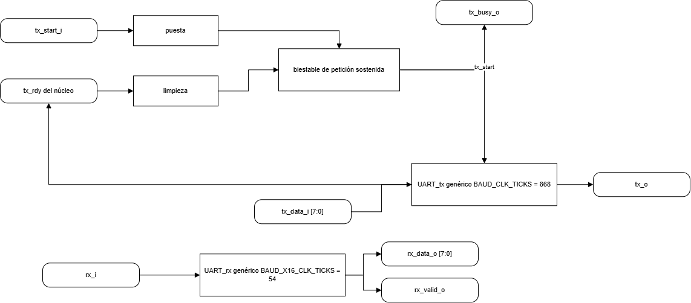

---

### 8.13 `uart_test_block`

**a) Nombre.** `uart_test_block.sv`, instancia `bloque_prueba`.

**b) Diagrama modular.** Ocupa el lugar de `uart_msg` en el diagrama de la sección 7.2 cuando `MODO_PRUEBA_UART = 1`.

**c) Objetivo.** Validar el periférico UART contra la PC antes de integrar el juego, enviando valores conocidos.

**d) Entradas.** `clk_i`, `rst_i`, `tick_i`, `rdata_i[31:0]`. Parámetro `PERIODO_MS = 200`.

**e) Salidas.** `we_o`, `addr_o[1:0]`, `wdata_o[31:0]` (maestro de la interfaz estándar) y `ultimo_rx_o[7:0]`.

**f) Relación con otros módulos.** Usa `uart_peripheral` igual que lo haría el juego. En modo de prueba, `top` muestra `ultimo_rx_o` en los LEDs 7 a 0.

**g) Funcionamiento.** Envía en ciclo la secuencia `A`…`Z` seguida de salto de línea, un byte cada 200 ms, y retransmite cualquier byte que reciba. El eco tiene prioridad sobre la secuencia.

**h) Diseño.** Como sigue la misma secuencia de acceso a registros que `uart_msg`, si funciona aquí, el acceso al periférico es correcto. Al sintetizar con `MODO_PRUEBA_UART = 0`, Vivado elimina su lógica.

---

### 8.14 `display_controller`

**a) Nombre.** `display_controller.sv`, instancia `displays`.

**b) Diagrama modular.**

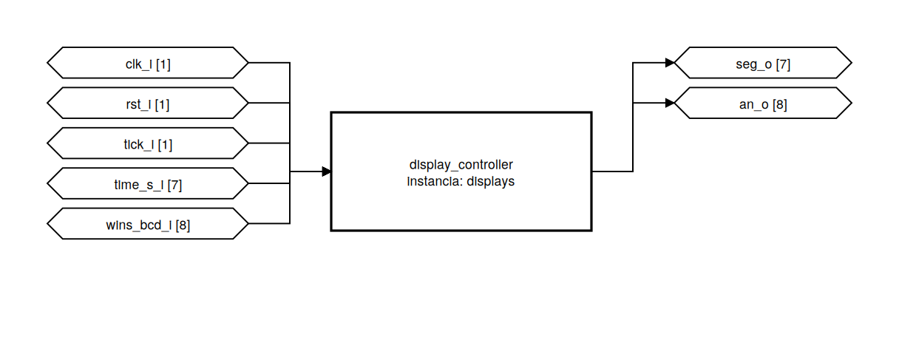

**c) Objetivo.** Mostrar tiempo restante y victorias en cuatro dígitos multiplexados.

**d) Entradas.** `clk_i`, `rst_i`, `tick_i`, `time_s_i[6:0]`, `wins_bcd_i[7:0]`. Parámetros `SEG_ACTIVE_LEVEL = 0`, `AN_ACTIVE_LEVEL = 0`.

**e) Salidas.** `seg_o[6:0]` (`g f e d c b a`) y `an_o[7:0]`.

**f) Relación con otros módulos.** Recibe el tick, los segundos de `round_timer` y las victorias de `game_controller`. No devuelve nada.

**g) Funcionamiento.** Un contador de 2 bits avanza con cada tick y elige qué dígito se enciende y qué valor se decodifica.

| Contador | Ánodo | Contenido |
|---|---|---|
| 0 | AN0 | unidades de victorias |
| 1 | AN1 | decenas de victorias |
| 2 | AN4 | unidades de segundos |
| 3 | AN5 | decenas de segundos |

AN2, AN3, AN6 y AN7 quedan apagados. Poner cada número en un bloque de cuatro dígitos evita que se lean como una sola cifra.

**h) Diseño.** Un dígito por milisegundo da un barrido de 4 ms, es decir 250 Hz, por encima del umbral de parpadeo. Los segundos se separan en decenas y unidades con división y residuo entre 10; como el divisor es constante y el rango es pequeño, se sintetiza como una red de LUTs.

| Dígito | g f e d c b a | Hex |
|---|---|---|
| 0 | 0111111 | 3F |
| 1 | 0000110 | 06 |
| 2 | 1011011 | 5B |
| 3 | 1001111 | 4F |
| 4 | 1100110 | 66 |
| 5 | 1101101 | 6D |
| 6 | 1111101 | 7D |
| 7 | 0000111 | 07 |
| 8 | 1111111 | 7F |
| 9 | 1101111 | 6F |
| 10–15 | 0000000 | 00 |

El decodificador se describe por tabla y no se minimiza con mapas de Karnaugh: cada salida depende de 4 entradas y ocupa una LUT de 6 entradas sin importar cómo se escriba. Las tablas usan 1 = encendido y la polaridad real se aplica al final en una línea. Los códigos 10–15 apagan el dígito, evitan latches y hacen visible un valor corrupto.

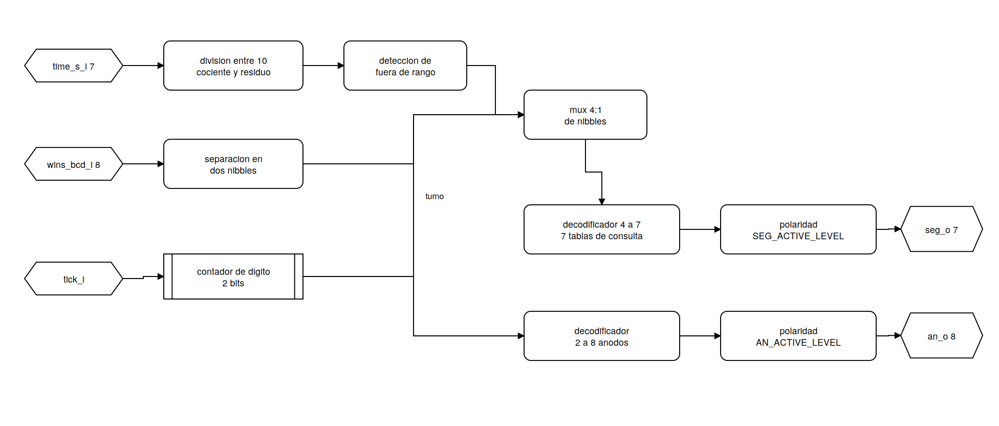

---

### 8.15 `led_controller`

**a) Nombre.** `led_controller.sv`, instancia `leds`.

**b) Diagrama modular.**

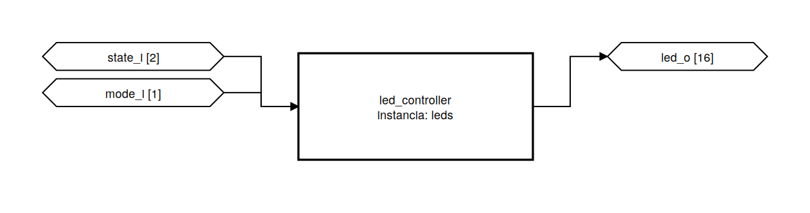

**c) Objetivo.** Indicar la etapa del juego y el modo seleccionado.

**d) Entradas.** `state_i[1:0]`, `mode_i`. Parámetro `LED_ACTIVE_LEVEL = 1`. Es combinacional.

**e) Salidas.** `led_o[15:0]`.

**f) Relación con otros módulos.** Recibe estado y modo de `game_controller`. En modo de prueba del UART, `top` pone en los LEDs el último byte recibido.

**g) Funcionamiento y h) Diseño.**

| `state_i` | Etapa | LED0 | LED1 | LED2 |
|---|---|---|---|---|
| 00 | selección | 1 | 0 | 0 |
| 01 | partida | 0 | 1 | 0 |
| 10 | resultado | 0 | 0 | 1 |
| 11 | no usado | 0 | 0 | 0 |

`led_o[15] = mode_i`; los demás quedan apagados. Un LED por etapa se distingue de un vistazo, mientras que con uno solo habría que codificar con parpadeos. El LED de modo está en el otro extremo para no confundirlo con los de etapa. El caso `11` existe para no inferir un latch.

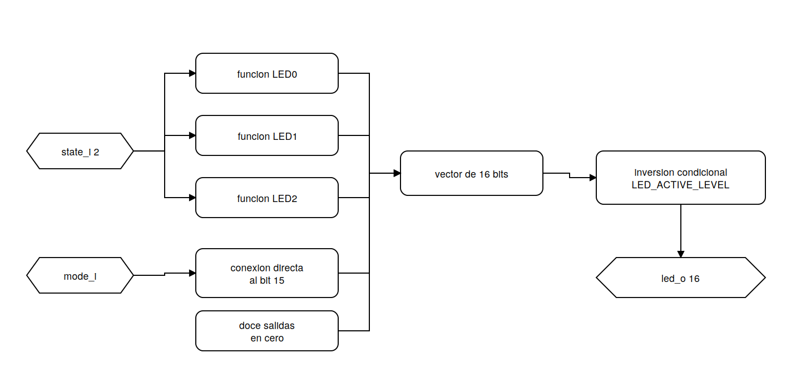

---

### 8.16 `buzzer_controller`

**a) Nombre.** `buzzer_controller.sv`, instancia `sonido`.

**b) Diagrama modular.**

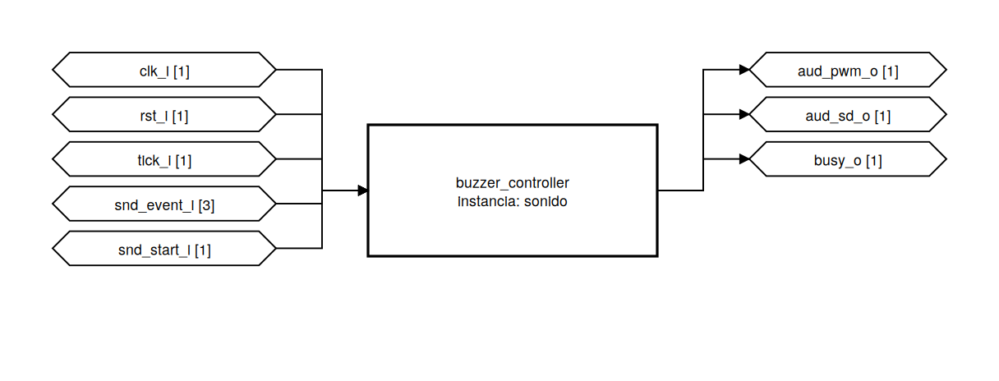

**c) Objetivo.** Generar un sonido distinto para acierto, error, victoria y derrota.

**d) Entradas.** `clk_i`, `rst_i`, `tick_i`, `snd_event_i[2:0]` (0 ninguno, 1 acierto, 2 error, 3 victoria, 4 derrota), `snd_start_i`. Parámetros `CLK_HZ`, `AMP_ENABLE_LEVEL`.

**e) Salidas.** `aud_pwm_o` (A11), `aud_sd_o` (D12), `busy_o`.

**f) Relación con otros módulos.** Recibe el tick y los eventos de `game_controller`. `busy_o` queda sin conectar en `top` porque el propio módulo decide qué hacer con eventos solapados; se usa en el testbench.

**g) Funcionamiento.** Al aceptar un evento arranca un contador de ciclos que invierte la salida cada semiperiodo y un contador de ticks que mide la duración del tono. Al terminar un tono pasa al siguiente o se apaga.

| Evento | Tonos | Duración por tono |
|---|---|---|
| Acierto | 2 kHz | 100 ms |
| Error | 500 Hz | 150 ms |
| Victoria | 2 → 2,5 → 3 kHz | 150 ms |
| Derrota | 800 → 500 Hz | 200 ms |

**h) Diseño.**

```
semiperiodo = (CLK_HZ + f) / (2 f)
```

| Frecuencia | Semiperiodo | Frecuencia real |
|---|---:|---:|
| 2 kHz | 25 000 | 2000,00 Hz |
| 2,5 kHz | 20 000 | 2500,00 Hz |
| 3 kHz | 16 667 | 2999,94 Hz |
| 800 Hz | 62 500 | 800,00 Hz |
| 500 Hz | 100 000 | 500,00 Hz |

| Situación | Qué pasa |
|---|---|
| Evento sin nada sonando | se acepta |
| Acierto o error con algo sonando | se descarta |
| Victoria o derrota con algo sonando | corta lo que suena y arranca |

El fin de partida no se puede perder: si la última letra acierta y gana, lo que debe oírse es la victoria. Los semiperiodos se calculan con `localparam` en síntesis; el contador del divisor es de 17 bits y el de duración de 8. La Nexys 4 no tiene zumbador, así que el sonido sale por el amplificador y el jack de 3,5 mm, con `aud_sd_o` en alto y `aud_pwm_o` como salida normal.

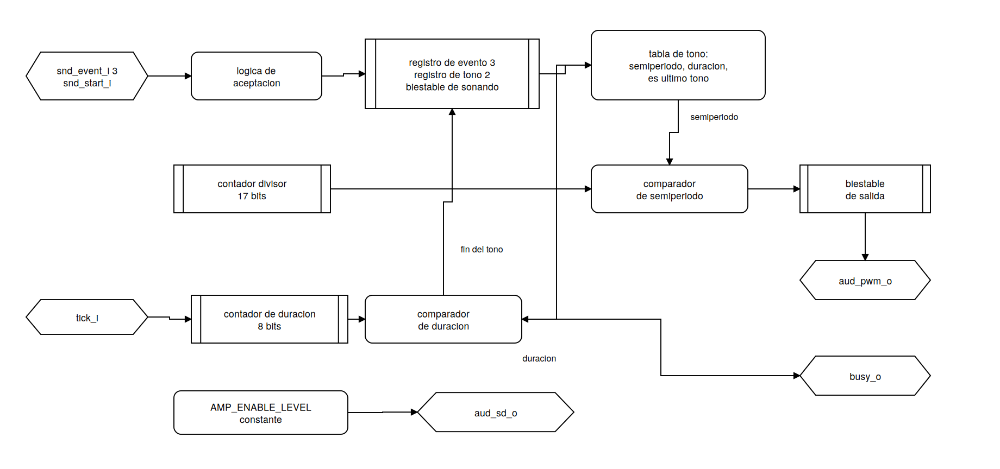

---

## 9. Quinto nivel: integración y conexiones

En un diseño con integrados, este nivel sería la unión de los esquemáticos y el plano de alambrado. En la FPGA, la unión de los módulos está en `top.sv` y las conexiones eléctricas son la asignación de pines.

### 9.1 Integración en `top`

| Instancia | Módulo | Recibe de | Entrega a |
|---|---|---|---|
| `base_tiempo` | `clk_tick_gen` | reloj | todas las instancias con `tick_i` |
| `filtro_rst`, `filtro_sel`, `filtro_ok` | `button_input` | botones, tick | reinicio del sistema, `juego` |
| `banco` | `word_rom` | `juego` | `juego` |
| `generador` | `lfsr` | — | `juego` |
| `temporizador` | `round_timer` | `juego`, tick | `juego`, `displays` |
| `juego` | `game_controller` | todos los anteriores, `pantalla`, `protocolo` | `pantalla`, `protocolo`, salidas locales |
| `pantalla` | `lcd_screen_ctrl` | `juego` | `periferico_lcd` |
| `periferico_lcd` | `lcd_peripheral` | `pantalla`, `modulo_lcd` | `modulo_lcd` |
| `modulo_lcd` | `lcd_controller` | `periferico_lcd`, tick | pines del Pmod |
| `protocolo` | `uart_msg` | `juego`, `periferico_uart` | `periferico_uart`, `juego` |
| `bloque_prueba` | `uart_test_block` | `periferico_uart`, tick | `periferico_uart` (solo en modo de prueba) |
| `periferico_uart` | `uart_peripheral` | maestro elegido, `nucleo_uart` | `nucleo_uart` |
| `nucleo_uart` | `uart_core` | pin C4 | pin D4 |
| `displays` | `display_controller` | `temporizador`, `juego` | pines de los displays |
| `leds` | `led_controller` | `juego` | pines de los LEDs |
| `sonido` | `buzzer_controller` | `juego`, tick | pines del audio |

El maestro del UART se escoge con el parámetro `MODO_PRUEBA_UART`, que es constante en síntesis, así que en el hardware solo queda un camino.

### 9.2 Asignación de pines

| Función | Puerto | Conector | Pines |
|---|---|---|---|
| Reloj | `clk_i` | — | E3 |
| Botones | `btn_rst_i`, `btn_sel_i`, `btn_ok_i` | BTNC, BTNL, BTNR | E16, T16, R10 |
| UART | `uart_rx_i`, `uart_tx_o` | USB-UART | C4, D4 |
| LCD datos | `lcd_db_o[3:0]` | JA1–JA4 | B13, F14, D17, E17 |
| LCD datos | `lcd_db_o[7:4]` | JA7–JA10 | G13, C17, D18, E18 |
| LCD control | `lcd_rs_o`, `lcd_rw_o`, `lcd_e_o` | JB7, JB8, JB9 | K16, R16, T9 |
| Segmentos | `seg_o[6:0]` | CA–CG | L3, N1, L5, L4, K3, M2, L6 |
| Ánodos | `an_o[7:0]` | AN0–AN7 | N6, M6, M3, N5, N2, N4, L1, M1 |
| LEDs | `led_o[15:0]` | LD0–LD15 | T8 (LD0) … P2 (LD15) |
| Audio | `aud_pwm_o`, `aud_sd_o` | AUD_PWM, AUD_SD | A11, D12 |

Todo con `LVCMOS33` y reloj declarado de 10 ns. El PmodCLP ocupa el JA completo (J1, datos) y la fila inferior del JB (J2, control): al montarlo se vio que, con J1 en el JA, el J2 no alcanza la fila superior. Se restringen los 16 LEDs aunque el juego use 4, porque el puerto es de 16 bits y el modo de prueba usa los 8 de abajo.

### 9.3 Polaridades

| Señal | Nivel activo | Parámetro |
|---|---|---|
| Pulsadores | alto | `BTN_ACTIVE_LEVEL = 1` |
| LEDs | alto | `LED_ACTIVE_LEVEL = 1` |
| Segmentos | bajo | `SEG_ACTIVE_LEVEL = 0` |
| Ánodos | bajo | `AN_ACTIVE_LEVEL = 0` |
| Amplificador | alto | `AMP_ENABLE_LEVEL = 1` |

Dentro de los módulos siempre se trabaja con 1 = activo y la polaridad real se aplica en la salida.

---

## 10. Interfaces de los periféricos y protocolo

### 10.1 Interfaz estándar

| Señal | Dirección | Descripción |
|---|---|---|
| `clk_i` | entrada | reloj de 100 MHz |
| `rst_i` | entrada | reinicio **síncrono**, activo en alto |
| `write_enable_i` | entrada | 1 = escritura |
| `addr_i[1:0]` | entrada | registro |
| `wdata_i[31:0]` | entrada | dato a escribir |
| `rdata_o[31:0]` | salida | lectura **combinacional** del registro indicado |

Que la lectura sea combinacional permite al maestro ver `busy`, `done`, `send` o `new_rx` en el mismo ciclo en que pone la dirección.

### 10.2 Periférico LCD

| `addr_i` | Offset | Registro |
|---|---|---|
| `00` | 0x00 | CONTROL/ESTADO |
| `01` | 0x04 | DATOS |
| `10`, `11` | — | reservado, lee 0 |

**CONTROL/ESTADO**

| Bit | Campo | Tipo | Función |
|---:|---|---|---|
| 0 | `start` | W1P | envía el byte de DATOS con el `rs` actual |
| 1 | `rs` | RW | 0 comando, 1 dato |
| 2 | `clear` | W1P | limpia la pantalla (`0x01`) |
| 3 | `home` | W1P | cursor al inicio (`0x02`) |
| 8 | `busy` | RO | hay una operación en curso |
| 9 | `done` | RO | terminó la última operación; se mantiene hasta aceptar otra |
| 31:16 | — | — | reservados, leen 0 |

Los bits W1P siempre se leen en 0. Prioridad `clear` > `home` > `start`; lo que llegue con `busy` = 1 se descarta.

**DATOS:** bits `[7:0]` con el carácter ASCII o el código de instrucción; bits `[31:8]` reservados.

### 10.3 Periférico UART

| `addr_i` | Registro | Contenido |
|---|---|---|
| `00` | DATOS 0 (TX) | byte a transmitir en `[7:0]` |
| `01` | DATOS 1 (RX) | último byte recibido en `[7:0]` |
| `10` | CONTROL | `send` (bit 0), `new_rx` (bit 1) |
| `11` | reservado | lee 0 |

| Bit | Campo | Escribir 1 | Escribir 0 | Leer |
|---:|---|---|---|---|
| 0 | `send` | inicia la transmisión si no hay otra | sin efecto | 1 mientras transmite; baja solo al terminar |
| 1 | `new_rx` | limpia el aviso | sin efecto | 1 si hay un byte sin leer |

### 10.4 Protocolo de aplicación

**PC → FPGA.** Un byte ASCII de `A` (0x41) a `Z` (0x5A). Cualquier otro valor se descarta en la FPGA sin afectar la partida. La aplicación de PC también valida antes de enviar.

**FPGA → PC.** Líneas ASCII terminadas en `\n`, con campos de ancho fijo.

| Mensaje | Formato | Largo | Cuándo |
|---|---|---|---|
| Inicio | `START:<M>:<LL>` | 10 | al empezar la partida |
| Patrón | `PATT:<p>` | 5 + largo de la palabra | al empezar y tras cada letra nueva |
| Letra | `LET:<X>:<R>` | 9 | al evaluar una letra |
| Intentos | `ERR:<n>` | 5 | al empezar y tras cada letra nueva |
| Fin | `END:<E>:<W>` | 8 + largo de la palabra | al terminar |

| Campo | Valores |
|---|---|
| `<M>` | `F` fácil, `D` difícil |
| `<LL>` | longitud con dos dígitos (`04` a `11`) |
| `<p>` | patrón con `_` en lo oculto |
| `<X>` | letra evaluada |
| `<R>` | `OK ` acierto, `NO ` error, `RPT` repetida (siempre 3 caracteres) |
| `<n>` | intentos restantes, `6 − errores` |
| `<E>` | `WIN` victoria, `LER` derrota por errores, `LTO` derrota por tiempo |
| `<W>` | palabra completa |

```
al empezar     START:F:07   PATT:_______   ERR:6
letra buena    LET:A:OK     PATT:A______   ERR:6
letra mala     LET:Z:NO     PATT:A______   ERR:5
repetida       LET:A:RPT
al terminar    END:WIN:ARBOLES
```

El tiempo restante no se envía; solo se ve en los displays. El ancho fijo simplifica los dos lados: en RTL solo el patrón y la palabra cambian de largo, y en Python se corta por posición. La secuencia más larga ronda los 34 bytes.

**Control de flujo.** Solo hay un registro de recepción, sin FIFO. La aplicación no habilita la siguiente letra hasta recibir la línea que cierra la anterior (`ERR:`, `LET:…:RPT` o `END:`). Si igual llega un byte de más, la FPGA lo descarta y la partida sigue.

---

## 11. Temporización

Todas las constantes bajan como parámetros desde `top`.

| Parámetro | Valor | Ciclos o ticks | Cálculo |
|---|---|---:|---|
| `TICK_CYCLES` | 1 ms | 100 000 ciclos | 100 × 10⁶ / 1000 |
| `DEBOUNCE_MS` | 10 ms | 10 ticks | — |
| `SEG_FACIL` | 60 s | 60 000 ticks | — |
| `SEG_DIFICIL` | 45 s | 45 000 ticks | — |
| `RESULT_MS` | 3 s | 3000 ticks | — |
| Multiplexado | 1 ms por dígito | 1 tick | 4 dígitos → 250 Hz |
| `BAUD_DIV` | 115 200 baud | 868 ciclos | 100 × 10⁶ / 115 200 = 868,06 |
| `BAUD_X16_DIV` | 115 200 × 16 | 54 ciclos | 868,06 / 16 = 54,25 |
| `LCD_POWERON_TICKS` | 50 ms | 50 ticks | manual: ≥ 20 ms |
| `LCD_CIC_CORTA` | 60 µs | 6000 ciclos | manual: ≥ 37 µs |
| `LCD_CIC_LARGA` | 2 ms | 200 000 ciclos | manual: ≥ 1,52 ms |
| `LCD_CIC_SETUP` | 200 ns | 20 ciclos | elección del equipo |
| `LCD_CIC_E_ALTO` | 1 µs | 100 ciclos | elección del equipo |
| `LCD_CIC_E_BAJO` | 1 µs | 100 ciclos | elección del equipo |

**Error de los divisores UART.**

| Lado | Valor ideal | Usado | Baudios reales | Error |
|---|---:|---:|---:|---:|
| TX | 868,06 | 868 | 115 207 | −0,006 % en el periodo |
| RX (×16) | 54,25 | 54 | 115 741 | −0,47 % en el periodo |

El receptor muestrea el bit *k* a 1,5 + *k* tiempos de bit del flanco de arranque. En el último bit de datos el error acumulado da 3,97 % de un bit, y sumando la latencia de detección del flanco de arranque (6,22 %) el peor caso queda en 10,2 % de un bit, frente al 50 % disponible. El margen es de casi cinco veces.

**Duraciones derivadas.**

| Operación | Duración aproximada |
|---|---|
| Ciclo de escritura del LCD (sin la espera) | 2,2 µs |
| Pantalla completa (34 transacciones) | ≈ 2 ms |
| Byte UART (10 bits) | 86,8 µs |
| Mensaje más largo (34 bytes, con reposo de ~3 bits entre bytes) | ≈ 4 ms |

Estas duraciones son muy pequeñas frente al segundo de resolución del temporizador, por eso no detener la cuenta mientras se publica no cambia el resultado de la partida.

---

## 12. Aplicación de PC y generador de la ROM

### 12.1 `ahorcado_terminal.py`

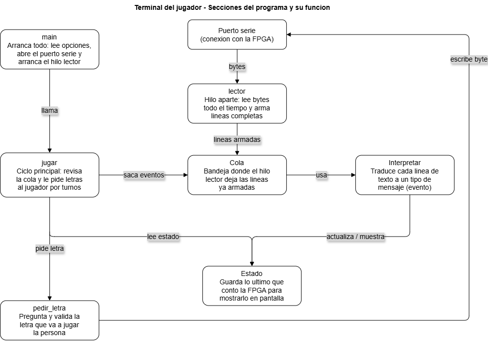

| Bloque | Función en el código | Qué hace |
|---|---|---|
| `main` | `main()` | lee opciones, abre el puerto, crea la cola y arranca el hilo lector |
| `lector` | `lector()` | hilo aparte que lee bytes y arma líneas al llegar `\n` |
| `Cola` | `queue.Queue()` | paso de líneas entre los dos hilos |
| `Interpretar` | `parsear()` | convierte una línea en `(tipo, datos)` o `None` |
| `Estado` | clase `Estado` | guarda el último patrón, intentos y letra |
| `jugar` | `jugar()` | ciclo principal: vacía la cola y pide letra |
| `pedir_letra` | `pedir_letra()` | pide y valida la letra |


Decisiones principales:

- **Hilo lector aparte.** El tiempo corre en la FPGA, así que la partida puede terminar mientras el jugador escribe. Con el hilo, el aviso de fin aparece de inmediato.
- **Un hilo solo lee y el otro solo escribe** el puerto, y se comunican con una `Queue`.
- **`parsear()` revisa el largo exacto** de cada línea y después corta por posición. Si una línea no encaja se avisa y se descarta, sin cerrar el programa.
- **Validación de la entrada:** exactamente un carácter A–Z, sin tildes ni Ñ. Si el jugador escribe otra cosa se le pide de nuevo. `salir`, `Ctrl+C` o `Ctrl+D` cierran la terminal.
- **No se envía nada fuera de partida,** y si llega un `END` mientras el jugador escribía, esa letra se descarta.
- **Protección contra ruido:** una línea de más de 80 caracteres sin `\n` se descarta; `\r` se ignora.
- El puerto se abre con `timeout = 0,2 s` y el hilo es `daemon` para que el programa cierre limpio.

El modo y el inicio de la partida se eligen en la tarjeta; la terminal espera el `START`.

### 12.2 `gen_word_rom.py`


Genera `word_rom.sv` a partir de dos listas de Python (`HARD_WORDS` y `EASY_WORDS`, 32 palabras cada una). Antes de generar revisa:

1. que haya exactamente 64 palabras;
2. que no haya repetidas;
3. que todas sean solo A–Z mayúsculas;
4. que midan entre 4 y 12 letras;
5. que los índices 0–31 tengan 6 letras o más;
6. que los índices 32–63 tengan menos de 6.

Si algo falla imprime `FAIL` con la lista de errores y no escribe nada. Con `--check` solo valida. El archivo generado avisa que no se debe editar a mano, rellena cada palabra con espacios hasta 12 caracteres y agrega un `default` con una palabra vacía.

---

## 13. Estrategia de implementación y plan de pruebas

### 13.1 Orden de trabajo

1. Módulos sueltos, cada uno con su testbench.
2. Subsistemas (cadena LCD, cadena UART, núcleo, periféricos locales).
3. Integración en `top` y prueba del sistema completo en simulación.
4. Síntesis: revisar que no haya latches ni múltiples drivers.
5. Implementación con timing cerrado a 100 MHz.
6. Simulación post-implementación temporizada, cubriendo la recepción y validación de una letra.
7. Prueba en la tarjeta.

Probar primero por partes hace que, si algo falla, se sepa en qué módulo está.

### 13.2 Testbenches

Todos los testbenches son autoverificables: generan estímulos deterministas, comparan contra el valor esperado y al final imprimen un resumen de pase o fallo. Los tiempos se reducen por parámetro para que la simulación sea viable.

| Testbench | Qué comprueba | Criterio de pase |
|---|---|---|
| `tb_clk_tick_gen` | 100 000 ciclos entre pulsos, pulso de un ciclo, reinicio | periodo y ancho exactos |
| `tb_button_input` | pulsación limpia, rebotes, pulsación corta, polaridades, 4 pulsaciones = 4 pulsos | cero comprobaciones fallidas |
| `tb_lfsr` | 255 estados distintos, nunca 0x00, vuelve a la semilla | 255 estados |
| `tb_word_rom` | longitudes, orden por dificultad, solo A–Z, relleno con espacios | 64 palabras correctas |
| `tb_round_timer` | carga, pausa, recarga, llegada a cero sin vuelta, vencimiento | intervalos exactos |
| `tb_game_controller` | letra correcta, incorrecta, repetida, victoria, seis errores, vencimiento, vencimiento durante publicación, prioridad, retorno, saturación en 99 | cero fallos |
| `tb_lcd_controller` | inicialización, tiempos, orden de fases, espera larga/corta, un solo `done`, reinicio, `lcd_rw_o` = 0 | cero fallos |
| `tb_lcd_peripheral` | escritura y lectura, `start`, `rs`, descarte con `busy`, prioridad, `done`, bits W1P y direcciones reservadas en 0 | cero fallos |
| `tb_lcd_screen_ctrl` | caracteres de cada pantalla, orden ignorada con `busy_o`, datos que cambian a mitad | byte y `rs` de cada paso |
| `tb_lcd_screen_snapshot`, `tb_lcd_step_decoder`, `tb_lcd_text_gen` | piezas internas de `lcd_screen_ctrl` | cero fallos |
| `tb_uart_peripheral` | registros, `send` y `new_rx` independientes, llegada simultánea a la limpieza, dirección reservada | cero fallos |
| `tb_uart_msg` | texto exacto de cada evento decodificado bit a bit, orden durante envío, datos que cambian a mitad, filtrado de bytes | cero fallos |
| `tb_uart_test_block` | secuencia A–Z sin saltos, eco, `ultimo_rx_o` | cero fallos |
| `tb_display_controller` | diez dígitos, códigos 10–15, barrido, un ánodo a la vez, ánodos no usados apagados, tiempo fuera de rango | cero fallos |
| `tb_led_controller` | cuatro estados, exclusión mutua (con aserción), bit de modo, polaridades | cero fallos |
| `tb_buzzer_controller` | frecuencia y duración de cada tono, secuencias, descarte y corte por evento de fin | cero fallos |
| `tb_top` | arranque sin pulsar nada, cambio de modo, inicio con `START`/`PATT`/`ERR`, letra correcta e incorrecta, derrota por seis fallos, retorno a selección y LEDs; observa solo los pines del LCD y la línea serie | cero fallos |

`uart_core` instancia VHDL, así que se prueba en Vivado (simulación de lenguaje mixto) y en la tarjeta. `tb_uart_peripheral`, `tb_uart_msg` y `tb_uart_test_block` usan un modelo de comportamiento del núcleo como extremo opuesto de la línea.

La aplicación de PC tiene su propia prueba, `PYTHON/DESIGN/test_terminal.py`, que juega una partida contra un puerto serie falso y revisa el troceo de las líneas, el rechazo de entradas inválidas y que nunca se envíe algo que no sea una letra.

### 13.3 Prueba en la tarjeta

1. **Antes de energizar:** J1 del PmodCLP en el JA y J2 en la fila inferior del JB, revisando la marca del pin 1.
2. **Programar y mirar el LCD:** si aparece la selección, el reloj, la inicialización y la cadena del LCD funcionan.
3. **Sin PC:** el botón izquierdo alterna el modo (LED15 lo sigue), el derecho inicia (LED1), los displays cuentan desde 60 o 45, y al vencer aparece `PERDISTE: TIEMPO` 3 s.
4. **Con la terminal:** `python ahorcado_terminal.py --list` para ver el puerto y `--port COMn` para abrirlo; al iniciar deben llegar `START`, `PATT` y `ERR`.
5. **Partida completa:** letra correcta, incorrecta, repetida y fin, revisando que LCD y terminal digan lo mismo y que suene cada evento.

---

## Referencias

[1] D. M. Harris y S. L. Harris, *Digital Design and Computer Architecture: RISC-V Edition*. Morgan Kaufmann, 2022.

[2] P. P. Chu, *FPGA Prototyping by SystemVerilog Examples*. Wiley, 2018.

[3] Hitachi Ltd., *HD44780U (LCD-II): Dot Matrix Liquid Crystal Display Controller/Driver*, Rev. 0.0, Hitachi Semiconductor, sep. 1999. [En línea]. Disponible: https://cdn.sparkfun.com/assets/9/5/f/7/b/HD44780.pdf

[4] Digilent Inc., *PmodCLP Reference Manual*. [En línea]. Disponible: https://digilent.com/reference/_media/pmod:pmod:pmodclp_rm.pdf

[5] Digilent Inc., *Nexys 4 Reference Manual*. [En línea]. Disponible: https://digilent.com/reference/programmable-logic/nexys-4/reference-manual

[6] J. González-Gómez y R. Coto Calderón, "Proyecto 2: Ahorcado — Juego electrónico FPGA/PC por enlace serial," EL3313 Taller de Diseño Digital, Escuela de Ingeniería Electrónica, Instituto Tecnológico de Costa Rica, II Semestre 2026.

[7] M. A. Hernández R., "Diseño Modular," Laboratorio de Diseño Lógico, Escuela de Ingeniería Electrónica, Instituto Tecnológico de Costa Rica.
