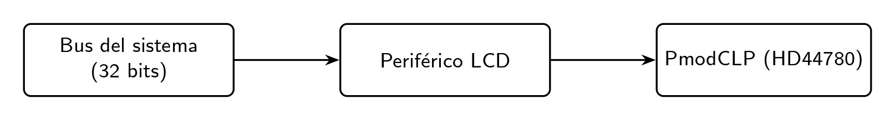
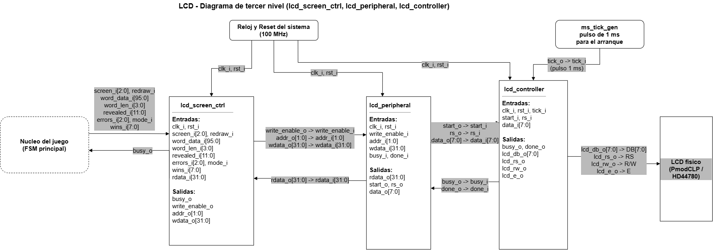
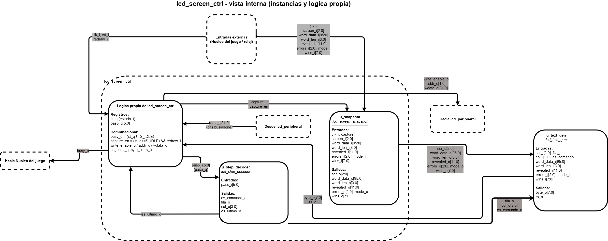
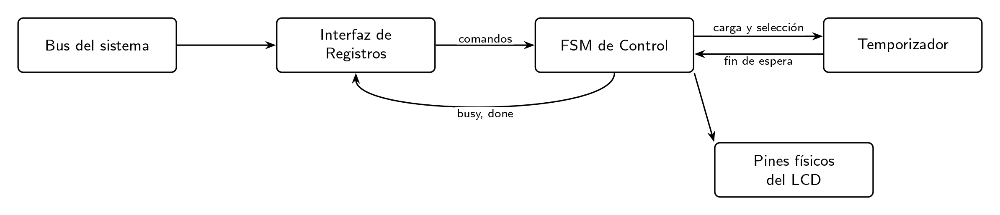
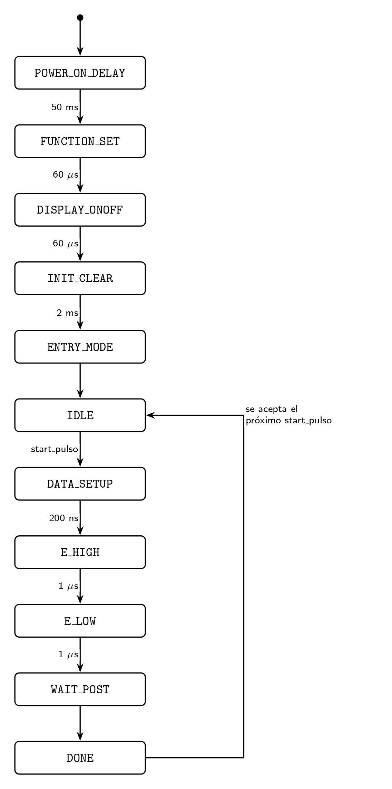

# Subsistema LCD — Ahorcado FPGA/PC

## 1. Introducción

 Se presenta el subsistema encargado de controlar la pantalla LCD PmodCLP.

El objetivo de este subsistema es permitir que el resto del juego pueda solicitar la visualización de una pantalla sin tener que manejar directamente las señales del LCD ni conocer los tiempos requeridos por este dispositivo. Estos tiempos se encuentran en el orden de microsegundos y milisegundos, por lo que requieren varios ciclos del reloj de 100 MHz utilizado por el sistema.

La versión final del subsistema está formada por tres módulos principales:

* `lcd_screen_ctrl`
* `lcd_peripheral`
* `lcd_controller`

Estos módulos se encuentran conectados en ese mismo orden. `lcd_screen_ctrl` se encarga de decidir qué información debe mostrarse, `lcd_peripheral` maneja la comunicación mediante registros y `lcd_controller` genera las señales físicas necesarias para el LCD.

Durante el desarrollo también se planteó una arquitectura preliminar diferente, en la que varias de estas funciones se encontraban agrupadas. Esta propuesta se incluye en las secciones correspondientes para mostrar la evolución del diseño.

## 2. Descripción general del sistema

El juego no controla directamente los pines del LCD. En su lugar, el módulo principal del juego envía una solicitud a `lcd_screen_ctrl`, que genera las operaciones necesarias para escribir la pantalla.

Estas operaciones pasan posteriormente por `lcd_peripheral`, que funciona como una interfaz de registros, y finalmente llegan a `lcd_controller`, encargado de generar las señales que necesita el PmodCLP.

La idea general del sistema se puede resumir de la siguiente manera:

1. El juego solicita qué pantalla debe mostrarse.
2. `lcd_screen_ctrl` recibe la solicitud y los datos actuales de la partida.
3. El módulo captura estos datos y genera las operaciones necesarias para formar las dos filas del LCD.
4. `lcd_peripheral` recibe las escrituras y las convierte en solicitudes para el controlador físico.
5. `lcd_controller` genera las señales del LCD respetando los tiempos establecidos.
6. Una vez terminada cada operación, se informa al módulo superior mediante las señales `busy` y `done`.

Al encender la FPGA, `lcd_controller` realiza automáticamente la inicialización del LCD. Mientras esta secuencia se encuentra en ejecución, el subsistema permanece ocupado.

Una vez terminada la inicialización, el sistema queda esperando nuevas solicitudes.

Cuando se está realizando un redibujado, una nueva solicitud no se procesa. El módulo superior debe esperar a que la operación actual termine antes de solicitar otra pantalla.

## 3. Diagrama modular de la versión final

El diagrama modular de tercer nivel es la principal referencia para organizar esta documentación. En él se muestran los tres módulos principales del subsistema y su relación con los demás bloques del proyecto.

Los tres módulos forman una cadena:

`game_controller → lcd_screen_ctrl → lcd_peripheral → lcd_controller → PmodCLP`

Cada módulo tiene una función específica. De esta forma, el módulo encargado del juego no necesita conocer los tiempos del LCD y el controlador físico no necesita conocer cómo se construye el texto de las pantallas.

El orden utilizado en el diagrama también será el orden utilizado para explicar los módulos en la siguiente sección.

# 4. Descripción de los módulos

## 4.1 `lcd_screen_ctrl`

### Objetivo

El módulo `lcd_screen_ctrl` se encarga de convertir una solicitud de alto nivel, como "mostrar esta pantalla", en las operaciones necesarias para escribir los caracteres correspondientes en el LCD.

De esta manera, `game_controller` solamente debe indicar qué pantalla quiere mostrar y proporcionar los datos de la partida. No necesita conocer cómo se escriben los caracteres en el LCD ni cómo se manejan los tiempos del periférico.

Para cada pantalla se realizan 34 transacciones:

* 1 transacción para posicionar el cursor al inicio de la primera fila.
* 16 transacciones para escribir los caracteres de la primera fila.
* 1 transacción para posicionar el cursor al inicio de la segunda fila.
* 16 transacciones para escribir los caracteres de la segunda fila.

En total:

**2 comandos de posicionamiento + 32 caracteres = 34 transacciones.**

### Entradas

| Señal         |   Ancho | Descripción                                                                                                  |
| ------------- | ------: | ------------------------------------------------------------------------------------------------------------ |
| `clk_i`       |   1 bit | Reloj del sistema de 100 MHz.                                                                                |
| `rst_i`       |   1 bit | Reinicio síncrono, activo en alto.                                                                           |
| `screen_i`    |  3 bits | Código de la pantalla que se desea mostrar.                                                                  |
| `redraw_i`    |   1 bit | Pulso que inicia el redibujado. Se ignora mientras el módulo está ocupado.                                   |
| `word_data_i` | 96 bits | Palabra utilizada durante la partida.                                                                        |
| `word_len_i`  |  4 bits | Longitud de la palabra.                                                                                      |
| `revealed_i`  | 12 bits | Indica qué posiciones de la palabra ya fueron descubiertas.                                                  |
| `errors_i`    |  3 bits | Cantidad de errores cometidos, de 0 a 6.                                                                     |
| `mode_i`      |   1 bit | Indica el modo de juego: 0 fácil y 1 difícil.                                                                |
| `wins_i`      |  8 bits | Cantidad de victorias acumuladas, representada en BCD.                                                       |
| `rdata_i`     | 32 bits | Datos leídos desde `lcd_peripheral`. Se utilizan principalmente los bits correspondientes a `busy` y `done`. |

### Salidas

Las principales salidas son:

* `busy_o`: indica que actualmente se está dibujando una pantalla.
* `write_enable_o`: habilita una escritura en el periférico.
* `addr_o`: dirección del registro que se desea escribir.
* `wdata_o`: dato de 32 bits que se escribe en el periférico.

### Pantallas

El sistema utiliza cinco códigos diferentes para las pantallas:

| Código | Nombre            | Contenido                                         |
| -----: | ----------------- | ------------------------------------------------- |
|      0 | `SCR_SELECT`      | `AHORCADO V:nn` y `MODO: FACIL` o `MODO: DIFICIL` |
|      1 | `SCR_PLAY`        | Patrón de la palabra e información de intentos    |
|      2 | `SCR_WIN`         | `GANASTE!` y la palabra                           |
|      3 | `SCR_LOSE_FALLOS` | `PERDISTE: FALLOS` y la palabra                   |
|      4 | `SCR_LOSE_TIEMPO` | `PERDISTE: TIEMPO` y la palabra                   |

### Relación con otros módulos

`lcd_screen_ctrl` se instancia en EL `top`.

Recibe las solicitudes y los datos provenientes de `game_controller`. A cambio, devuelve `busy_o` para indicar si actualmente está realizando un redibujado.

Su única comunicación hacia el LCD se realiza mediante `lcd_peripheral`. Por lo tanto, `lcd_screen_ctrl` funciona como el único maestro de este periférico.

Esto evita que diferentes bloques del sistema intenten escribir simultáneamente sobre el mismo conjunto de registros.

### Funcionamiento interno

Cuando se recibe una solicitud de redibujado mientras el módulo está libre, se realiza una copia de los datos actuales de la partida y el contador de pasos se coloca en cero.

A partir de ese momento, el módulo procesa los 34 pasos necesarios para completar la pantalla.

Para cada paso se realiza, en términos generales, el siguiente proceso:

1. Esperar a que `lcd_peripheral` indique que no está ocupado.
2. Preparar el byte que se debe enviar.
3. Escribir el byte en el registro correspondiente.
4. Escribir el registro de control indicando el tipo de operación.
5. Esperar a que la operación termine.
6. Pasar al siguiente paso.

El byte que se debe enviar no se encuentra escrito directamente dentro de la máquina de estados. El contador de pasos se utiliza para determinar si se trata de un comando de posicionamiento o de un carácter de la pantalla.

Para esto se utilizan los módulos internos `lcd_step_decoder` y `lcd_text_gen`.

Dentro de `lcd_screen_ctrl` se utilizan los siguientes bloques:

| Módulo                | Tipo          | Función                                                                               |
| --------------------- | ------------- | ------------------------------------------------------------------------------------- |
| `lcd_screen_snapshot` | Secuencial    | Guarda los datos de la partida cuando comienza un redibujado.                         |
| `lcd_step_decoder`    | Combinacional | Determina qué operación corresponde al paso actual.                                   |
| `lcd_text_gen`        | Combinacional | Genera el carácter que debe mostrarse.                                                |
| `lcd_screen_pkg`      | Paquete       | Contiene constantes compartidas, como códigos de pantalla y direcciones de registros. |

Esta separación permite que la lógica encargada de formar los textos no esté mezclada directamente con la máquina de estados que controla el bus.

### Snapshot de los datos

El módulo `lcd_screen_snapshot` guarda una copia de los datos de la partida cuando se acepta una nueva solicitud.

Esto es importante porque el redibujado requiere varias operaciones y puede tardar varios milisegundos. Si se utilizaran directamente las entradas del módulo durante todo el proceso, los datos podrían cambiar mientras se está escribiendo la pantalla.

Por ejemplo, una parte de la pantalla podría corresponder al estado anterior de la partida y otra parte al estado nuevo.

Al utilizar el snapshot, toda la pantalla se genera utilizando los mismos datos que estaban presentes cuando comenzó el redibujado.

El snapshot no necesita una entrada de reinicio, ya que solamente se utiliza después de recibir la orden de captura.

### Cálculo de la columna

El cálculo de la columna utiliza aritmética de 4 bits. Debido al tamaño del valor, cuando se alcanza el último carácter de una fila la operación puede dar la vuelta hasta el valor 15.

Esto permite utilizar el mismo cálculo para las diferentes posiciones sin agregar un caso especial para la última columna.

Esta implementación depende de que la pantalla utilizada tenga 16 columnas por fila.

### Máquina de estados

La máquina de estados utilizada para controlar la comunicación con `lcd_peripheral` está formada por los siguientes estados:

| Estado    | Condición          | Siguiente estado | Función                                     |
| --------- | ------------------ | ---------------- | ------------------------------------------- |
| `S_IDLE`  | `redraw_i`         | `S_LIBRE`        | Captura los datos y coloca el paso en cero. |
| `S_LIBRE` | `busy` en 0        | `S_DATOS`        | Continúa con la operación.                  |
| `S_LIBRE` | `busy` en 1        | `S_LIBRE`        | Sigue esperando.                            |
| `S_DATOS` | —                  | `S_CTRL`         | Escribe el byte.                            |
| `S_CTRL`  | —                  | `S_FIN`          | Escribe `rs` y `start`.                     |
| `S_FIN`   | `done` y paso < 33 | `S_LIBRE`        | Avanza al siguiente paso.                   |
| `S_FIN`   | `done` y paso = 33 | `S_IDLE`         | Finaliza el redibujado.                     |
| `S_FIN`   | Sin `done`         | `S_FIN`          | Continúa esperando.                         |

### Verificación

El módulo se verifica mediante `tb_lcd_screen_ctrl`.

La prueba comprueba los caracteres correspondientes a las diferentes pantallas y permite verificar el funcionamiento conjunto de los bloques internos.

También se comprueba que:

* una solicitud nueva sea ignorada mientras `busy_o` está activo;
* cambiar los datos durante un redibujado no modifique la pantalla que ya está en proceso;
* `busy_o` se active al comenzar el redibujado;
* `busy_o` vuelva a cero después de completar el paso 33.

### Recursos
Se utiliza una máquina de estados de cinco estados, un contador de pasos de seis bits y lógica combinacional asociada al generador de texto.

---

## 4.2 `lcd_peripheral`

### Objetivo

`lcd_peripheral` funciona como una interfaz entre `lcd_screen_ctrl` y `lcd_controller`.

Su función principal es presentar el LCD como un periférico controlado mediante registros de 32 bits. De esta manera, `lcd_screen_ctrl` puede realizar escrituras y lecturas de registros sin tener que manejar directamente las señales físicas del LCD.

### Entradas

* `clk_i`
* `rst_i`
* `write_enable_i`
* `addr_i` de 2 bits
* `wdata_i` de 32 bits
* `busy_i`
* `done_i`

Los bits 31 a 10 de `wdata_i` están reservados.

### Salidas

* `rdata_o`
* `start_o`
* `rs_o`
* `data_o`

### Mapa de registros

| `addr_i` | Registro         | Contenido                            |
| -------- | ---------------- | ------------------------------------ |
| `00`     | CONTROL y ESTADO | Solicitudes y estados del periférico |
| `01`     | DATOS            | Byte que se desea enviar             |
| `10`     | Reservado        | Lee cero                             |
| `11`     | Reservado        | Lee cero                             |

### Registro de control

| Bit | Nombre  | Tipo               | Función                                            |
| --: | ------- | ------------------ | -------------------------------------------------- |
|   0 | `start` | Pulso de escritura | Solicita enviar el byte almacenado.                |
|   1 | `rs`    | Lectura/escritura  | 0 para comando y 1 para dato.                      |
|   2 | `clear` | Pulso de escritura | Solicita limpiar la pantalla.                      |
|   3 | `home`  | Pulso de escritura | Coloca el cursor al inicio sin borrar la pantalla. |
|   8 | `busy`  | Solo lectura       | Indica que existe una operación en curso.          |
|   9 | `done`  | Solo lectura       | Indica que la operación anterior terminó.          |

Los bits correspondientes a `start`, `clear` y `home` son solicitudes de un solo ciclo. Por esta razón, al leer el registro estos bits siempre aparecen como cero.

En la propuesta inicial del proyecto este comportamiento se describía como bits **W1P** (*write-1-to-pulse*). La idea es la misma: escribir un uno genera un pulso, pero el bit no queda almacenado como un estado permanente.

### Relación con otros módulos

El módulo se instancia una sola vez en `top`, bajo el nombre `periferico_lcd`.

Su maestro es `lcd_screen_ctrl`, mientras que su salida se conecta con `lcd_controller`.

Además, la interfaz utiliza una estructura de registros de 32 bits similar a la utilizada por `uart_peripheral`, por lo que ambos periféricos siguen una organización parecida.

### Funcionamiento

Las escrituras se realizan de forma síncrona. Cuando `write_enable_i` está activo, `addr_i` determina qué registro se modifica y `wdata_i` contiene el dato correspondiente.

La lectura de `rdata_o` es combinacional. Esto permite que el módulo superior pueda consultar el estado de `busy` y `done` sin tener que esperar un ciclo adicional.

Cuando se recibe una solicitud y `lcd_controller` no está ocupado, `lcd_peripheral` genera las señales necesarias para iniciar la operación.

Si el controlador se encuentra ocupado, la solicitud se descarta.

### Aviso `done`

Una parte importante del diseño es el manejo de `done`.

`lcd_controller` genera `done_i` como un pulso de un solo ciclo. `lcd_peripheral` convierte este pulso en un aviso que permanece activo hasta que se acepta una nueva operación.

Esto permite que `lcd_screen_ctrl` pueda consultar el estado mediante el registro sin tener que coincidir exactamente con el ciclo en que se produjo el pulso original.

### Prioridad de solicitudes

Si se escriben varios bits de solicitud al mismo tiempo, se utiliza una prioridad.

La prioridad es:

`clear > home > start`

De esta forma, si se solicita limpiar la pantalla y realizar otra operación al mismo tiempo, se procesa primero `clear`.

Una solicitud recibida mientras el controlador está ocupado se descarta. Esto es suficiente para el funcionamiento actual porque `lcd_screen_ctrl` consulta `busy` antes de enviar una nueva operación.

Los códigos de las instrucciones `clear` (`8'h01`) y `home` (`8'h02`) son generados por el propio periférico. Por lo tanto, el módulo superior no necesita enviar estos valores directamente.

### Diseño preliminar

En la propuesta inicial del proyecto, las funciones que posteriormente se dividieron entre `lcd_peripheral` y `lcd_controller` se encontraban dentro de una arquitectura más general.

En esa propuesta existía un bloque denominado "Interfaz de Registros", cuya función era similar a la del `lcd_peripheral` actual: recibir las operaciones del sistema, interpretar las direcciones y proporcionar los datos de lectura.

La principal diferencia es que en la versión inicial la interfaz se comunicaba con una única FSM encargada de realizar más funciones. En la versión final se decidió separar la interfaz de registros del control físico del LCD.

Esta modificación permite que `lcd_peripheral` se encargue de la comunicación mediante registros, mientras que los tiempos y las señales físicas quedan concentrados en `lcd_controller`.

### Verificación

Las pruebas del módulo comprueban:

* escritura de los registros;
* lectura de los registros;
* generación de `start`;
* generación correcta de `rs` y del byte;
* descarte de solicitudes mientras `busy` está activo;
* prioridad entre `clear`, `home` y `start`;
* comportamiento de `done`;
* lectura en cero de los bits de solicitud;
* lectura en cero de las direcciones reservadas.

### Recursos

La implementación utiliza registros para almacenar el byte de datos, la información de control y el estado de `done`, además de la lógica combinacional necesaria para decodificar las direcciones y generar `rdata_o`.

---

## 4.3 `lcd_controller`

### Objetivo

`lcd_controller` es el módulo encargado de controlar directamente las señales del PmodCLP.

Su función es recibir una solicitud de escritura desde `lcd_peripheral` y convertirla en una secuencia de señales compatible con el controlador HD44780.

También se encarga de realizar automáticamente la inicialización del LCD al encender la FPGA.

### Entradas

* `clk_i`
* `rst_i`
* `tick_i`
* `start_i`
* `rs_i`
* `data_i`

`tick_i` corresponde a una habilitación de 1 ms generada externamente.

### Salidas

* `busy_o`
* `done_o`
* `lcd_db_o`
* `lcd_rs_o`
* `lcd_rw_o`
* `lcd_e_o`

### Conexión física

Las señales se conectan al PmodCLP mediante los siguientes pines:

| Señal           | Conector   | Pin FPGA           |
| --------------- | ---------- | ------------------ |
| `lcd_db_o[3:0]` | JA1 a JA4  | B13, F14, D17, E17 |
| `lcd_db_o[7:4]` | JA7 a JA10 | G13, C17, D18, E18 |
| `lcd_rs_o`      | JB7        | K16                |
| `lcd_rw_o`      | JB8        | R16                |
| `lcd_e_o`       | JB9        | T9                 |

### Relación con otros módulos

`lcd_controller` se instancia una sola vez en `top`, bajo el nombre `modulo_lcd`.

Recibe las solicitudes provenientes de `lcd_peripheral` y devuelve las señales `busy_o` y `done_o`.

Sus salidas `lcd_db_o`, `lcd_rs_o`, `lcd_rw_o` y `lcd_e_o` se conectan directamente a los pines correspondientes del PmodCLP.

### Secuencia de inicialización

Al comenzar la operación, el módulo realiza una secuencia de inicialización antes de aceptar nuevas solicitudes.

La secuencia utilizada es:

| Paso          | Código  | Función                                        | Espera |
| ------------- | ------- | ---------------------------------------------- | -----: |
| Function Set  | `8'h38` | 8 bits, 2 líneas y matriz 5×8                  |  60 µs |
| Display On    | `8'h0C` | Display encendido y cursor apagado             |  60 µs |
| Clear Display | `8'h01` | Limpia la pantalla                             |   2 ms |
| Entry Mode    | `8'h06` | Incrementa el cursor sin desplazar la pantalla |  60 µs |

Antes del primer comando se realiza una espera inicial de 50 ms.

Según la hoja de datos del PmodCLP, se recomienda una espera inicial de aproximadamente 20 ms. En el proyecto se utilizan 50 ms para agregar un margen adicional

Durante esta etapa `busy_o` permanece activo, por lo que el resto del sistema no puede iniciar una operación de escritura sobre el LCD.

### Ciclo de escritura

Una escritura normal se divide en varias etapas.

Primero se colocan los datos y la señal `rs`. Después se activa `E` durante el tiempo establecido y finalmente se desactiva.

Posteriormente se espera el tiempo necesario antes de considerar terminada la operación.

La secuencia utilizada es:

1. Establecimiento de datos y `rs`.
2. `E` en alto.
3. `E` en bajo.
4. Espera posterior a la operación.

En la implementación actual se utilizan aproximadamente:

* 200 ns para establecer los datos;
* 1 µs con `E` en alto;
* 1 µs con `E` en bajo;
* 60 µs de espera para instrucciones normales;
* 2 ms para `clear` y `home`.

El propio `lcd_controller` determina qué tiempo de espera utilizar según la instrucción que se está ejecutando.

### Máquina de estados

La FSM final utiliza siete estados:

| Estado      | Condición                                  | Siguiente estado |
| ----------- | ------------------------------------------ | ---------------- |
| `S_POWERON` | Se completan los 50 ms                     | `S_CARGA`        |
| `S_CARGA`   | Condición incondicional                    | `S_SETUP`        |
| `S_SETUP`   | Se cumplen los 200 ns                      | `S_E_ALTO`       |
| `S_E_ALTO`  | Se cumple 1 µs                             | `S_E_BAJO`       |
| `S_E_BAJO`  | Se cumple 1 µs                             | `S_ESPERA`       |
| `S_ESPERA`  | Espera completa e inicialización pendiente | `S_CARGA`        |
| `S_ESPERA`  | Espera completa e inicialización terminada | `S_IDLE`         |
| `S_IDLE`    | `start_i` activo                           | `S_CARGA`        |

### Diseño preliminar

En la propuesta inicial se habían definido estados separados para las diferentes instrucciones de arranque:

* `POWER_ON_DELAY`
* `FUNCTION_SET`
* `DISPLAY_ONOFF`
* `INIT_CLEAR`
* `ENTRY_MODE`

En la versión final se decidió utilizar un contador para determinar qué instrucción de inicialización corresponde en cada paso.
La arquitectura final conserva las operaciones principales de la propuesta inicial, pero distribuye las funciones entre módulos separados.

### Decisiones de diseño

#### No se lee la bandera de ocupado del LCD

El diseño no utiliza una lectura directa de la bandera de ocupado del controlador del LCD.

Para hacer esto sería necesario utilizar el bus de datos en ambas direcciones, incluyendo lógica adicional para controlar cuándo la FPGA transmite y cuándo recibe información.

En lugar de eso, el diseño espera los tiempos correspondientes mediante contadores. Para este proyecto, esta solución es suficiente porque los tiempos del LCD son pequeños en comparación con los tiempos generales del juego.

#### Dimensionamiento de los contadores

El contador utilizado para las esperas en ciclos de reloj debe cubrir el mayor tiempo utilizado por las operaciones.

Para una espera máxima de 2 ms con un reloj de 100 MHz se necesitan:

$$
2\,ms \times 100\,MHz = 200\,000\ ciclos
$$

Por lo tanto, el contador necesita suficientes bits para representar al menos 200 000:

$$
\lceil \log_2(200000) \rceil = 18
$$

Por esta razón se utiliza un contador de 18 bits para las esperas basadas en ciclos de reloj.

La espera inicial de 50 ms utiliza el `tick_i` de 1 ms, por lo que no es necesario contar directamente los 5 millones de ciclos de reloj correspondientes a ese tiempo.

Esto permite utilizar un contador de menor tamaño para esta parte del proceso.

#### Inicialización del LCD

El módulo utiliza valores iniciales para comenzar automáticamente la secuencia de configuración cuando la FPGA es programada.

Además, el reinicio durante la operación normal puede cancelar la operación actual sin necesidad de repetir la espera completa de 50 ms, según el comportamiento implementado.

#### Tiempos de `E`

Los tiempos utilizados para el establecimiento de datos, E en alto y E en bajo fueron definidos como parte de la implementación del proyecto. Se seleccionaron valores con margen respecto a los tiempos requeridos por el controlador y posteriormente se verificó el funcionamiento en la tarjeta.

#### Parámetros de tiempo

Los tiempos se manejan mediante parámetros para facilitar la simulación.

Durante las simulaciones se pueden utilizar valores más pequeños para no tener que esperar los tiempos físicos completos, mientras que para la implementación en FPGA se utilizan los valores reales.

### Manejo de `clear` y `home`

En la propuesta inicial quedó pendiente determinar si las instrucciones `clear` y `home` debían utilizar una espera mayor que las instrucciones normales.

En la implementación final esta decisión queda dentro de `lcd_controller`, que identifica estas instrucciones y utiliza la espera correspondiente.

De esta forma, `lcd_peripheral` no necesita indicar manualmente cuánto tiempo debe esperar.

### Verificación

La verificación de `lcd_controller` incluye:

* secuencia completa de inicialización;
* tiempos de espera;
* orden de las diferentes fases de escritura;
* estabilidad de los datos durante la operación;
* selección de la espera larga o corta;
* generación de un solo pulso de `done_o`;
* comportamiento ante un reinicio durante una operación;
* mantenimiento de `lcd_rw_o` en cero.

### Recursos

La implementación utiliza la FSM de siete estados, contadores para las diferentes esperas y un contador para los pasos de inicialización.

El contador principal utilizado para las esperas basadas en ciclos de reloj es de 18 bits, mientras que el contador de la espera de encendido utiliza seis bits cuando se cuenta mediante pulsos de 1 ms.

---

# 5. Integración de los módulos

Los tres módulos principales se conectan en cadena:

| Maestro           | Esclavo           | Información enviada                          | Información recibida          |
| ----------------- | ----------------- | --------------------------------------------- | ----------------------------- |
| `game_controller` | `lcd_screen_ctrl` | `screen_i`, `redraw_i` y datos de la partida | `busy_o`                      |
| `lcd_screen_ctrl` | `lcd_peripheral`  | `write_enable_o`, `addr_o`, `wdata_o`        | `rdata_o` con `busy` y `done` |
| `lcd_peripheral`  | `lcd_controller`  | `start_o`, `rs_o`, `data_o`                  | `busy_o`, `done_o`            |

Esta organización permite que cada módulo se encargue de una parte específica del funcionamiento del LCD.

`game_controller` no necesita conocer el protocolo del LCD.

`lcd_screen_ctrl` se concentra en construir las pantallas.

`lcd_peripheral` se encarga de manejar los registros y las solicitudes.

Finalmente, `lcd_controller` se encarga de los tiempos y de las señales físicas.

Esta misma idea se utiliza en otros periféricos del proyecto, como `uart_peripheral`, donde también se utiliza una interfaz basada en registros.

# 6. Funcionamiento general del sistema

## 6.1 Al encender la FPGA

Al iniciar el sistema, `lcd_controller` comienza automáticamente la secuencia de inicialización.

Primero espera 50 ms y posteriormente envía las cuatro instrucciones necesarias para configurar el LCD.

Mientras este proceso está activo, `busy_o` permanece activo. Esta señal se transmite hacia los módulos superiores, evitando que se intente iniciar un nuevo redibujado antes de que el LCD esté listo.

## 6.2 Cuando se solicita una pantalla

Cuando `game_controller` necesita actualizar el LCD, coloca los datos correspondientes en las entradas de `lcd_screen_ctrl` y genera `redraw_i`.

`lcd_screen_ctrl` captura los datos y comienza a procesar los 34 pasos de la pantalla.

Para cada paso:

1. Espera a que el periférico esté disponible.
2. Determina el carácter o comando correspondiente.
3. Escribe el byte en `lcd_peripheral`.
4. Configura `rs`.
5. Solicita la operación.
6. Espera a que termine.
7. Avanza al siguiente paso.

`lcd_peripheral` convierte esta solicitud en una operación para `lcd_controller`.

`lcd_controller` realiza la secuencia física de escritura y genera `done_o` al terminar.

Este aviso vuelve hacia `lcd_peripheral` y posteriormente puede ser consultado por `lcd_screen_ctrl`.

Cuando se completa el paso 33, el redibujado termina y `busy_o` vuelve a cero.

## 6.3 Pantallas del juego

Las pantallas utilizadas por el sistema son:

| Pantalla           | Línea 0              | Línea 1                         |
| ------------------ | --------------------- | -------------------------------- |
| Selección de modo  | `AHORCADO V:nn`      | `MODO: FACIL` / `MODO: DIFICIL` |
| Partida            | Patrón de la palabra | `INTENTOS: n` y el modo         |
| Victoria           | `GANASTE!`           | La palabra                      |
| Derrota por fallos | `PERDISTE: FALLOS`   | La palabra                      |
| Derrota por tiempo | `PERDISTE: TIEMPO`   | La palabra                      |

Estas cinco pantallas corresponden a los códigos definidos en `lcd_screen_pkg`.

## 6.4 Cuándo se actualiza la pantalla

El LCD no se redibuja continuamente. Una actualización solamente se solicita cuando ocurre un cambio que debe reflejarse en la pantalla.

Entre estos casos se encuentran:

* entrada a la pantalla de selección;
* cambio de modo;
* inicio de una partida;
* cambio en las letras descubiertas;
* cambio en la cantidad de intentos;
* entrada a una pantalla de resultado;
* actualización de la cantidad de partidas ganadas.

Esto evita estar escribiendo continuamente sobre el LCD y permite que el sistema mantenga la pantalla estable mientras no haya información nueva que mostrar.

Cuando se utiliza un tiempo de visualización para la pantalla de resultado, este debe comenzar después de completar el redibujado, de manera que los tres segundos correspondan al tiempo en que la pantalla ya está completamente escrita.

# 7. Verificación y estado del proyecto

Cada uno de los módulos principales cuenta con pruebas específicas.

Para `lcd_screen_ctrl` se utiliza `tb_lcd_screen_ctrl`, que permite comprobar el funcionamiento conjunto del controlador de pantallas y sus bloques internos.

En `lcd_peripheral` se prueban las operaciones de lectura y escritura, las señales de control y las diferentes condiciones de solicitud.

En `lcd_controller` se comprueba la secuencia de inicialización, las fases de escritura y los tiempos asociados.

En conjunto, las pruebas permiten verificar:

* la inicialización del LCD;
* la comunicación entre los tres módulos;
* el ciclo de escritura;
* el manejo de `busy`;
* el manejo de `done`;
* la prioridad de las solicitudes;
* el descarte de operaciones mientras el controlador está ocupado;
* la generación de las diferentes pantallas;
* el contenido de los caracteres enviados.

## Referencias

[1] Hitachi Ltd., *HD44780U (LCD-II): Dot Matrix Liquid Crystal Display Controller/Driver*, Rev. 0.0, Hitachi Semiconductor, Sep. 1999. [En línea]. Disponible: https://cdn.sparkfun.com/assets/9/5/f/7/b/HD44780.pdf

[2] Digilent Inc., *PmodCLP Reference Manual*, Digilent Inc. [En línea]. Disponible: https://digilent.com/reference/_media/pmod:pmod:pmodclp_rm.pdf

[3] J. González-Gómez y R. Coto Calderón, "Proyecto 2: Ahorcado — Juego electrónico FPGA/PC por enlace serial," EL3313 Taller de Diseño Digital, Escuela de Ingeniería Electrónica, Instituto Tecnológico de Costa Rica, II Semestre 2026.

[4] M. A. Hernández R., "Diseño Modular," Laboratorio de Diseño Lógico, Escuela de Ingeniería Electrónica, Instituto Tecnológico de Costa Rica.
