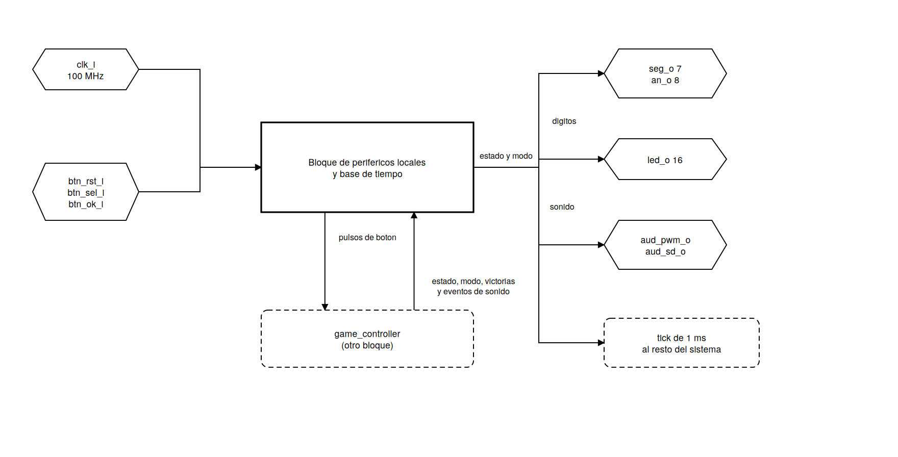
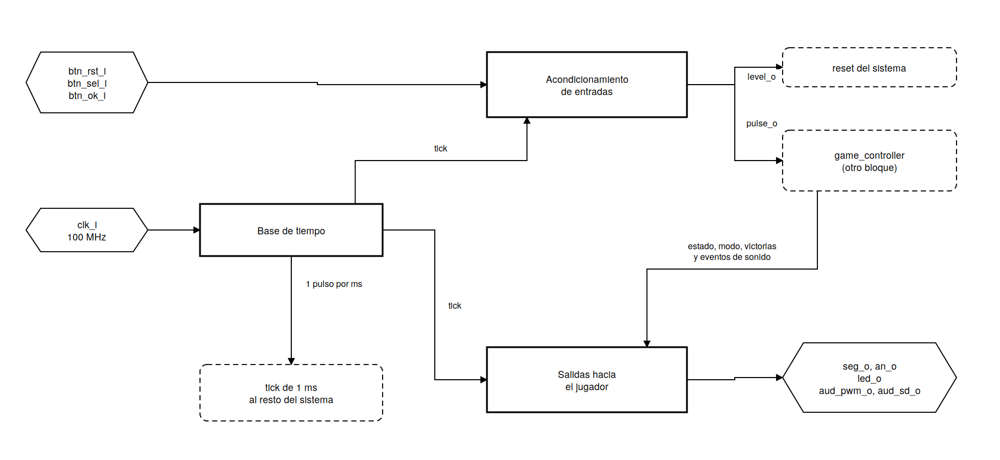

# Periféricos locales y base de tiempo — Ahorcado FPGA/PC

## 1. Introducción

Se presenta el bloque encargado de las entradas y salidas locales de la tarjeta y de la
base de tiempo del sistema.

El objetivo de este bloque es que el resto del juego pueda leer los botones y mostrar
información en la tarjeta sin tener que manejar directamente las señales físicas ni contar
ciclos de reloj. Los pulsadores rebotan durante milisegundos y llegan sin ninguna relación
con el reloj; los displays comparten las líneas de segmento y hay que multiplexarlos; el
sonido necesita ondas de frecuencia y duración precisas. Todo eso se resuelve acá, y el
control del juego solo publica valores.

El bloque está formado por cinco módulos:

* `clk_tick_gen`
* `button_input`
* `display_controller`
* `led_controller`
* `buzzer_controller`

En donde `clk_tick_gen` es la base de tiempo de la que dependen casi todos los demás módulos del proyecto,
`button_input` es la única entrada del sistema aparte del enlace serial, y los otros tres
son salidas independientes entre sí que reciben lo que el control del juego publica.

El sistema se implementa completamente en FPGA. Por eso el esquemático por compuertas y el
diagrama de conexiones por chips no aplican tal cual: no hay integrados ni alambrado sobre
protoboard. La representación equivalente es el diagrama de la estructura interna de cada
módulo, con sus registros, contadores, comparadores, multiplexores y decodificadores, y la
asignación de pines de la sección 6, que es lo que se escribe en el archivo de
restricciones.


## 2. Primer nivel: el bloque completo

El juego no lee los pulsadores ni escribe en los displays. Las entradas físicas entran a
este bloque, se acondicionan y salen como eventos limpios hacia `game_controller`; en
sentido contrario, el control publica el estado de la partida y el bloque lo traduce a lo
que se ve y se oye en la tarjeta.



### Objetivo

Acondicionar las entradas y salidas locales de la tarjeta y generar la base de tiempo del
sistema, de modo que el resto del juego trabaje con valores y eventos y no con señales
físicas.

### Entradas

Desde la tarjeta:

| Señal | Ancho | Origen |
|---|---|---|
| `clk_i` | 1 bit | oscilador de 100 MHz |
| `btn_rst_i` | 1 bit | pulsador central |
| `btn_sel_i` | 1 bit | pulsador izquierdo |
| `btn_ok_i` | 1 bit | pulsador derecho |

Desde el resto del sistema:

| Señal | Ancho | Origen |
|---|---|---|
| `time_s_i` | 7 bits | `round_timer` |
| `wins_bcd_i` | 8 bits | `game_controller` |
| `state_i` | 2 bits | `game_controller` |
| `mode_i` | 1 bit | `game_controller` |
| `snd_event_i` | 3 bits | `game_controller` |
| `snd_start_i` | 1 bit | `game_controller` |

### Salidas

Hacia la tarjeta:

| Señal | Ancho | Destino |
|---|---|---|
| `seg_o` | 7 bits | segmentos de los displays |
| `an_o` | 8 bits | ánodos de los displays |
| `led_o` | 16 bits | LEDs |
| `aud_pwm_o` | 1 bit | amplificador de audio |
| `aud_sd_o` | 1 bit | habilitación del amplificador |

Hacia el resto del sistema:

| Señal | Ancho | Destino |
|---|---|---|
| `tick_o` | 1 bit | base de tiempo de todo el proyecto |
| `level_o` del filtro central | 1 bit | reinicio del sistema |
| `pulse_o` de los otros dos filtros | 1 bit cada uno | `game_controller` |

### Explicación general

La idea general se puede resumir así:

1. `clk_tick_gen` divide el reloj de 100 MHz y produce un pulso de un ciclo cada
   milisegundo.
2. Ese pulso es la única base de tiempo del sistema: nueve instancias lo usan.
3. Los tres pulsadores pasan por `button_input`, que los sincroniza, les quita los rebotes
   y produce un pulso limpio o un nivel estable, según cuál de las dos formas necesite
   quien lo consume.
4. `game_controller` publica el estado de la partida, el modo, las victorias y los eventos
   de sonido.
5. `display_controller` multiplexa cuatro dígitos, `led_controller` traduce el estado a
   LEDs y `buzzer_controller` genera la onda del sonido.
6. Las tres salidas van directamente a los pines de la tarjeta.

Ninguno de los tres módulos de salida devuelve información al control del juego. No hay
señales de ocupado ni de fin: el control publica y sigue. Es una diferencia respecto al
subsistema del LCD y al de la UART, donde sí hay que esperar, y se debe a que acá ninguna
operación tarda: los displays y los LEDs responden en el mismo ciclo, y el sonido resuelve
por su cuenta qué hacer si le llega un evento mientras está ocupado.

## 3. Segundo nivel: bloques generales

El bloque se subdivide en tres partes según el trabajo que hace cada una: la que genera el
tiempo, la que acondiciona lo que entra y la que produce lo que el jugador ve y oye.



### 3.1 Base de tiempo

**Objetivo.** Producir una referencia de tiempo común para todo el sistema a partir del
reloj de la tarjeta.

**Entradas.** El reloj de 100 MHz.

**Salidas.** Un pulso de habilitación de un ciclo cada milisegundo, que va a los otros dos
bloques y al resto del proyecto.

**Explicación.** Todo lo que en el juego depende del tiempo (los segundos de la partida, el
filtrado de los botones, el barrido de los displays, la duración de los tonos, los tiempos
del LCD) necesita intervalos de milisegundos, y el reloj de la tarjeta es de 10 ns. Este
bloque hace esa conversión una sola vez y la reparte. La alternativa sería que cada módulo
contara ciclos por su cuenta, lo que repetiría el mismo contador varias veces y haría que
los tiempos de unos y otros no coincidieran exactamente.

### 3.2 Acondicionamiento de entradas

**Objetivo.** Convertir lo que entrega un pulsador mecánico en señales utilizables por
lógica síncrona.

**Entradas.** Los tres pulsadores y la habilitación de 1 ms.

**Salidas.** Un nivel estable, que se usa como reinicio del sistema, y dos pulsos de un
ciclo hacia `game_controller`.

**Explicación.** Los pulsadores llegan sin relación con el reloj y con rebotes de varios
milisegundos. Si se conectaran directamente a la máquina de estados, una sola pulsación se
contaría muchas veces y la señal podría dejar registros en estado metaestable. Este bloque
es el que hace que el control del juego pueda tratar un botón como un evento y no como una
señal eléctrica.

### 3.3 Salidas hacia el jugador

**Objetivo.** Traducir lo que el control del juego publica a lo que se ve y se oye en la
tarjeta.

**Entradas.** El estado, el modo, las victorias, los segundos restantes, los eventos de
sonido y la habilitación de 1 ms.

**Salidas.** Los segmentos y ánodos de los displays, los LEDs y las dos señales del
amplificador de audio.

**Explicación.** Cada salida física tiene su propia manera de manejarse: los displays
comparten las líneas de segmento y hay que multiplexarlos, los LEDs solo necesitan una
decodificación y el audio necesita una onda cuadrada de frecuencia y duración controladas.
Este bloque agrupa esos tres trabajos, que tienen en común que reciben información y no
devuelven nada.

### Explicación del conjunto

Los tres bloques trabajan en paralelo, no en cadena. La base de tiempo alimenta a los otros
dos y al resto del proyecto; el de entradas produce eventos que el control del juego
consume; el de salidas consume lo que el control publica. El único camino que atraviesa el
sistema completo pasa por fuera de este bloque: una pulsación entra por el bloque de
entradas, `game_controller` decide qué hacer y el resultado vuelve como estado, victorias o
evento de sonido al bloque de salidas.

## 4. Tercer nivel: diagrama modular

El diagrama de tercer nivel muestra los cinco módulos, sus conexiones y su relación con los
bloques vecinos.


Se ven las tres direcciones de flujo del bloque:

| Camino | Módulos | Qué transporta |
|---|---|---|
| Base de tiempo | `clk_tick_gen` hacia todo el sistema | un pulso por milisegundo |
| Entrada | tres instancias de `button_input` | reinicio, cambio de modo y confirmación |
| Salida | `display_controller`, `led_controller`, `buzzer_controller` | lo que el jugador ve y oye |

Resumen de los cinco módulos:

| Módulo | Objetivo | Entradas | Salidas |
|---|---|---|---|
| `clk_tick_gen` | generar el pulso de 1 ms | `clk_i`, `rst_i` | `tick_o` |
| `button_input` ×3 | sincronizar y filtrar un pulsador | `clk_i`, `rst_i`, `tick_i`, `btn_i` | `pulse_o`, `level_o` |
| `display_controller` | multiplexar cuatro dígitos | `clk_i`, `rst_i`, `tick_i`, `time_s_i`, `wins_bcd_i` | `seg_o`, `an_o` |
| `led_controller` | mostrar etapa y modo | `state_i`, `mode_i` | `led_o` |
| `buzzer_controller` | generar los tonos | `clk_i`, `rst_i`, `tick_i`, `snd_event_i`, `snd_start_i` | `aud_pwm_o`, `aud_sd_o`, `busy_o` |

Trabajando en conjunto, `clk_tick_gen` marca el paso de los otros cuatro: sin su pulso los
filtros de botón no avanzan, los displays no cambian de dígito y los tonos no terminan.
Las tres instancias de `button_input` son el único punto por donde el jugador actúa sobre
la tarjeta, y los tres módulos de salida son independientes entre sí, de modo que un
problema en uno no afecta a los otros dos. El orden del diagrama es el que se usa en la
sección siguiente: primero la base de tiempo, después la entrada y al final las tres
salidas.

# 5. Cuarto nivel: descripción de los módulos

## 5.1 `clk_tick_gen`

Archivo: `clk_tick_gen.sv`. Se instancia una vez en `top`, con el nombre `base_tiempo`.

### Diagrama modular

Bloque tomado del diagrama de tercer nivel del subsistema.


### Objetivo

Producir un pulso de habilitación de un ciclo de duración cada milisegundo, para que el
resto del sistema pueda medir tiempo sin necesidad de un segundo reloj.

### Entradas

| Señal | Ancho | Descripción |
|---|---|---|
| `clk_i` | 1 bit | Reloj del sistema de 100 MHz. |
| `rst_i` | 1 bit | Reinicio síncrono, activo en alto. |

Parámetro `TICK_CYCLES`, por defecto 100 000, que son los ciclos entre dos pulsos.

### Salidas

| Señal | Ancho | Descripción |
|---|---|---|
| `tick_o` | 1 bit | Pulso de un ciclo, una vez por milisegundo. |

### Relación con otros módulos

Es la fuente de tiempo de todo el proyecto. Su salida alimenta nueve instancias: los tres
filtros de botón, el temporizador de la partida, el control del juego, el controlador
físico del LCD, el multiplexado de los displays, la duración de los tonos del buzzer y el
bloque de pruebas de la UART.

Ningún otro módulo mide tiempo por su cuenta a partir del reloj, salvo los que necesitan
más resolución que un milisegundo: el generador de la onda del sonido, el ciclo de bus del
LCD y el divisor de baudios de la UART, que llevan su propio contador de ciclos.

En `top` este módulo recibe un cero fijo en su entrada de reinicio, por la razón que se
explica más abajo.

### Estructura interna


Un contador avanza una unidad en cada flanco de reloj. Cuando alcanza el valor límite,
`tick_o` se pone en alto durante ese único ciclo y el contador vuelve a cero.

### Cálculo del valor límite

```
100 000 000 ciclos/s / 1000 ms/s = 100 000 ciclos por milisegundo
```

El contador debe llegar hasta 99 999, así que su ancho es:

```
ceil(log2(100 000)) = 17 bits        2^17 = 131 072 >= 100 000
```

El periodo resultante es exacto: 100 000 ciclos de 10 ns son exactamente 1 ms, sin error de
redondeo. Eso importa porque de este tick dependen los 60 segundos de la partida, y un
error por ciclo se acumularía sesenta mil veces.

### Tabla de transición

| Estado del contador | `tick_o` | Siguiente valor |
|---|---|---|
| `rst_i` activo | 0 | 0 |
| 0 a 99 998 | 0 | contador + 1 |
| 99 999 | **1** | 0 |

### Decisiones de diseño

**El tick no se registra.** La salida es directamente el comparador. Un tick registrado
llegaría un ciclo tarde y habría que compensar ese retardo en cada uno de los nueve
consumidores.

**`tick_o` es una habilitación, no un reloj.** Los módulos que la usan siguen trabajando con
el reloj de 100 MHz y solo ejecutan su acción en los ciclos en que la habilitación está en
alto. La señal se conecta a la entrada de datos de la lógica, nunca a una entrada de reloj,
así que se muestrea en el flanco como cualquier otra señal del diseño y las herramientas la
analizan dentro del mismo dominio.

**No se divide el reloj.** La alternativa sería generar una señal de 1 kHz y usarla como
reloj en los módulos lentos. Eso crearía un segundo dominio, obligaría a restricciones de
tiempo adicionales y a sincronizadores entre dominios, y un reloj generado con lógica
ordinaria no viaja por la red dedicada de distribución del dispositivo, así que llega a
cada registro con retardos distintos. La habilitación evita todo eso a cambio de un
contador.

**Valor inicial y reinicio.** El contador declara su valor inicial en cero, que en la FPGA
se carga desde el bitstream durante la configuración. Por eso en `top` recibe un cero fijo
en lugar del reinicio del sistema: ese reinicio proviene de un filtro de botón que a su vez
necesita el tick, así que hacerlo depender del reinicio sería circular.

### Verificación

Se comprueba que haya exactamente 100 000 ciclos entre dos pulsos, que el pulso dure un
solo ciclo, que tras un reinicio el periodo siguiente sea completo y que el primer pulso
llegue sin haber pulsado nada.

### Recursos

17 registros del contador, un incrementador de 17 bits y un comparador de igualdad contra
una constante.

---

## 5.2 `button_input`

Archivo: `button_input.sv`. Se instancia **tres veces** en `top`.

### Diagrama modular

Bloque tomado del diagrama de tercer nivel del subsistema.


### Objetivo

Convertir la señal de un pulsador mecánico, asíncrona respecto al reloj y con rebotes, en
un nivel limpio y en un pulso de un ciclo utilizables por una máquina de estados.

### Entradas

| Señal | Ancho | Descripción |
|---|---|---|
| `clk_i` | 1 bit | Reloj del sistema de 100 MHz. |
| `rst_i` | 1 bit | Reinicio síncrono, activo en alto. |
| `tick_i` | 1 bit | Habilitación de 1 ms. El filtro solo avanza cuando está activa. |
| `btn_i` | 1 bit | Entrada física del pulsador, sin sincronizar. |

Parámetros `DEBOUNCE_MS`, por defecto 10, y `BTN_ACTIVE_LEVEL`, por defecto 1.

### Salidas

| Señal | Ancho | Descripción |
|---|---|---|
| `pulse_o` | 1 bit | Un ciclo en alto en la transición de soltado a presionado. |
| `level_o` | 1 bit | Nivel ya filtrado. Uno significa presionado. |

### Relación con otros módulos

Las tres instancias son:

| Instancia | Botón | Pin | Salida que se usa | Destino |
|---|---|---|---|---|
| `filtro_rst` | central, `BTNC` | E16 | `level_o` | reinicio de todo el sistema |
| `filtro_sel` | izquierdo, `BTNL` | T16 | `pulse_o` | `game_controller`, alterna el modo |
| `filtro_ok` | derecho, `BTNR` | R10 | `pulse_o` | `game_controller`, confirma e inicia |

Cada instancia usa una sola de las dos salidas y la otra se deja sin conectar. El módulo
entrega las dos porque los usos son distintos: el reinicio conviene como nivel, para que
mientras el botón esté apretado el sistema se mantenga reiniciado, y los otros dos como
evento, para que una pulsación sostenida no se cuente muchas veces.

El filtro del botón central es el único que recibe un cero fijo en su entrada de reinicio,
porque no puede depender del reinicio que él mismo genera.

El botón `btnCpuReset`, en el pin C12, es un botón distinto y de polaridad contraria. No se
usa en el proyecto.

### Estructura interna


La entrada atraviesa tres etapas, cada una resolviendo un problema distinto.

**Normalización de polaridad.** Se compara `btn_i` con `BTN_ACTIVE_LEVEL`, de modo que de
ahí en adelante un uno significa presionado sin importar cómo sea el botón físico.

**Sincronizador.** Dos flip-flops en cascada llevan la señal al dominio del reloj.

**Filtro de rebotes.** Un contador mide cuánto tiempo lleva la señal sincronizada
difiriendo del nivel considerado estable. Si la señal vuelve al valor anterior, el contador
se reinicia. Solo cuando el desacuerdo se mantiene durante los ticks configurados se adopta
el nuevo nivel.

**Detector de flanco.** Un registro guarda el nivel estable del ciclo anterior; comparándolo
con el actual se produce un pulso en la transición de soltado a presionado.

### Tabla de transición del filtro

| Comparación | Condición | Acción del contador | Nivel estable |
|---|---|---|---|
| `sync` igual al nivel estable | — | vuelve a 0 | sin cambio |
| distintos | `tick_i` y cuenta menor que `DEBOUNCE_MS` − 1 | +1 | sin cambio |
| distintos | `tick_i` y cuenta igual a `DEBOUNCE_MS` − 1 | vuelve a 0 | adopta el nuevo |
| distintos | sin `tick_i` | sin cambio | sin cambio |

La comparación es contra `DEBOUNCE_MS` − 1 y no contra `DEBOUNCE_MS`: el contador recorre de
0 a 9, que son diez ticks.

### Dimensionamiento del contador

El contador cuenta ticks de 1 ms y no ciclos de reloj:

| Estrategia | Cuenta máxima para 10 ms | Bits necesarios |
|---|---|---|
| Ciclos de reloj a 100 MHz | 1 000 000 | 20 |
| Ticks de milisegundo | 10 | 4 |

```
ceil(log2(10)) = 4 bits
```

### Decisiones de diseño

**Por qué dos flip-flops.** El pulsador cambia en cualquier instante respecto al reloj, así
que puede violar el tiempo de establecimiento del primero y dejarlo metaestable. El segundo
reduce mucho la probabilidad de que esa metaestabilidad llegue al resto del módulo: un
sincronizador de dos etapas no garantiza la resolución, pero hace que el tiempo medio entre
fallos sea muy grande. Los dos flip-flops no llevan reinicio, a propósito: su trabajo es
copiar la entrada.

**Por qué 10 ms.** Los contactos de un pulsador rebotan típicamente unos pocos
milisegundos. Diez dejan margen y siguen siendo imperceptibles; un valor mucho mayor
empezaría a sentirse pesado y uno menor dejaría pasar rebotes.

**El tiempo real no es exactamente 10 ms.** La pulsación no cae sincronizada con los ticks,
así que el primer tick después de ella llega en algún momento entre 0 y 1 ms. El intervalo
que se puede esperar es:

| Caso | Tiempo hasta adoptar el nivel |
|---|---|
| La pulsación cae justo antes de un tick | poco más de 9 ms |
| La pulsación cae justo después de un tick | 10 ms |

Para el propósito del filtro es suficiente, pero conviene tenerlo escrito: el módulo no
garantiza el valor del parámetro sino un intervalo de hasta un milisegundo por debajo de él.
El testbench comprueba que la adopción del nivel caiga dentro de ese intervalo.

**Por qué contar solo mientras hay desacuerdo.** Cada oscilación del rebote devuelve el
contador a cero. Solo un nivel sostenido durante los diez ticks cambia el estado. La
alternativa, muestrear cada 10 ms y quedarse con lo que se lea, podría muestrear justo en
medio de un rebote.

**Por qué el detector de flanco es necesario.** Sin él, el control del juego vería el botón
presionado durante todo el tiempo que dure la pulsación, que a 100 MHz son millones de
ciclos, y el modo cambiaría sin parar mientras el dedo estuviera encima.

### Verificación

Se comprueban la pulsación limpia, los rebotes al cerrar y al abrir, una pulsación más
corta que el filtro, las dos polaridades, la duración del filtro dentro del intervalo
esperado, y que cuatro pulsaciones seguidas produzcan exactamente cuatro pulsos.

### Recursos

8 registros: dos del sincronizador, cuatro del contador, uno del nivel estable y uno del
detector de flanco. Un comparador de igualdad contra el límite y uno de desacuerdo de un
bit.

---

## 5.3 `display_controller`

Archivo: `display_controller.sv`. Se instancia una vez en `top`, con el nombre `displays`.

### Diagrama modular

Bloque tomado del diagrama de tercer nivel del subsistema.


### Objetivo

Mostrar el tiempo restante y las partidas ganadas en cuatro dígitos de siete segmentos que
comparten físicamente las líneas de segmento, de modo que se perciban encendidos de forma
continua.

### Entradas

| Señal | Ancho | Descripción |
|---|---|---|
| `clk_i` | 1 bit | Reloj del sistema de 100 MHz. |
| `rst_i` | 1 bit | Reinicio síncrono, activo en alto. |
| `tick_i` | 1 bit | Habilitación de 1 ms, avanza el dígito del barrido. |
| `time_s_i` | 7 bits | Segundos restantes, normalmente de 0 a 60. |
| `wins_bcd_i` | 8 bits | Victorias acumuladas en BCD, dos dígitos. |

Parámetros `SEG_ACTIVE_LEVEL` y `AN_ACTIVE_LEVEL`, ambos por defecto 0.

### Salidas

| Señal | Ancho | Descripción |
|---|---|---|
| `seg_o` | 7 bits | Patrón de segmentos del dígito activo. |
| `an_o` | 8 bits | Habilitación de cada uno de los ocho dígitos. |

Correspondencia entre bits y segmentos:

| Bit | `seg_o[6]` | `seg_o[5]` | `seg_o[4]` | `seg_o[3]` | `seg_o[2]` | `seg_o[1]` | `seg_o[0]` |
|---|---|---|---|---|---|---|---|
| Segmento | g | f | e | d | c | b | a |

```
     a
   -----
 f |   | b
   | g |
   -----
 e |   | c
   -----
     d
```

### Relación con otros módulos

Recibe la habilitación de 1 ms de `clk_tick_gen`, los segundos de `round_timer` y las
victorias de `game_controller`. Sus dos salidas van directamente a los pines y no pasan por
ningún otro módulo.

Es un módulo de solo lectura respecto al resto del sistema: muestra lo que le llega y no
devuelve nada, así que ni el temporizador ni el control tienen que esperarlo.

### Estructura interna


Los ocho dígitos comparten las siete líneas de segmento, de modo que en un instante dado
todos los habilitados muestran lo mismo. Un contador de dos bits indica de cuál dígito es el
turno; avanza con cada tick y, por ser de dos bits, después del 3 vuelve al 0 sin lógica
adicional. Ese contador selecciona a la vez qué valor se decodifica y qué ánodo se habilita.

### Frecuencia de barrido

Con un dígito por milisegundo, el ciclo completo dura 4 ms:

```
1 / 4 ms = 250 Hz
```

El umbral de fusión de parpadeo del ojo humano está alrededor de 60 Hz, así que 250 Hz queda
cómodamente por encima. Reutilizar el tick evita añadir un divisor que ya existe.

### Distribución de los dígitos

| Contador | Ánodo activo | Contenido |
|---|---|---|
| 0 | AN0 | unidades de victorias |
| 1 | AN1 | decenas de victorias |
| 2 | AN4 | unidades de segundos |
| 3 | AN5 | decenas de segundos |

Los ocho dígitos forman dos bloques de cuatro separados por un hueco físico. Con los cuatro
dígitos seguidos en un mismo bloque, las victorias y los segundos se leían como un solo
número de cuatro cifras. Repartiéndolos uno a cada bloque, ambos pegados al hueco, la
separación la hace la propia tarjeta. `AN2`, `AN3`, `AN6` y `AN7` se mantienen apagados.

El reparto no afecta la frecuencia: siguen siendo cuatro dígitos por vuelta, uno por
milisegundo, y en el código son dos líneas de la tabla de ánodos.

### Tabla de verdad del decodificador de siete segmentos

Con la convención de uno igual a segmento encendido:

| Dígito | Segmentos encendidos | g f e d c b a | Hex |
|---|---|---|---|
| 0 | a b c d e f | 0 1 1 1 1 1 1 | 3F |
| 1 | b c | 0 0 0 0 1 1 0 | 06 |
| 2 | a b d e g | 1 0 1 1 0 1 1 | 5B |
| 3 | a b c d g | 1 0 0 1 1 1 1 | 4F |
| 4 | b c f g | 1 1 0 0 1 1 0 | 66 |
| 5 | a c d f g | 1 1 0 1 1 0 1 | 6D |
| 6 | a c d e f g | 1 1 1 1 1 0 1 | 7D |
| 7 | a b c | 0 0 0 0 1 1 1 | 07 |
| 8 | todos | 1 1 1 1 1 1 1 | 7F |
| 9 | a b c d f g | 1 1 0 1 1 1 1 | 6F |
| 10 a 15 | ninguno | 0 0 0 0 0 0 0 | 00 |

### Tabla del decodificador de ánodos

| Contador | `an_o` interno, uno = habilitado |
|---|---|
| 0 | `0000_0001` |
| 1 | `0000_0010` |
| 2 | `0001_0000` |
| 3 | `0010_0000` |

### Decisiones de diseño

**Separación del tiempo en dígitos.** El temporizador entrega los segundos en binario y el
decodificador necesita dígitos decimales. La conversión es la división entera entre diez y
su residuo; como el divisor es constante y el rango está acotado a 61 valores, la
herramienta lo resuelve con una red pequeña de tablas de consulta y no con un divisor real.
La alternativa sería que el temporizador contara en BCD, pero tiene que entregar el valor
también en binario para las comparaciones del control.

**Valor fuera de rango.** Si llegara un tiempo mayor de 99, el cociente no cabría en un
dígito. En ese caso se envía al decodificador un código que no corresponde a ningún dígito,
con lo que se apaga solo el dígito de las decenas y el resto del display sigue funcionando.
Es uno de los casos del testbench.

**Describir el decodificador por tabla y no minimizar.** La conversión se escribe como una
enumeración de las diez combinaciones. La alternativa sería obtener las siete funciones
booleanas y simplificarlas con mapas de Karnaugh, que es indispensable con compuertas
discretas porque cada término eliminado es un integrado menos. En esta FPGA no aporta nada:
los bloques lógicos de la Artix-7 contienen tablas de consulta de seis entradas, capaces de
implementar cualquier función de hasta seis variables con un único recurso. Cada salida del
decodificador depende de cuatro entradas, así que ocupa una tabla y el costo total es de
siete, sin importar cómo se escriba la función. La descripción por tabla produce el mismo
hardware, es más legible y elimina el riesgo de equivocarse minimizando a mano.

**Polaridad al final.** Las dos tablas se escriben con uno igual a encendido y la conversión
a la polaridad real se hace en una sola línea por salida. Así la tabla del documento y la del
código son la misma, y si la polaridad fuera otra se cambia un parámetro. Los displays de la
tarjeta son de ánodo común, así que los dos parámetros quedan en 0.

**El caso de 10 a 15** apaga el dígito. Existe para no inferir un latch por dejar
combinaciones sin asignar, y para hacer visible una eventual corrupción del valor.

### Verificación

Se comprueban los diez dígitos contra la tabla, los valores de 10 a 15, el orden del
barrido, que nunca haya dos ánodos activos a la vez, que los cuatro ánodos no usados estén
siempre apagados, que una vuelta dure cuatro ticks, el tiempo fuera de rango y las dos
polaridades.

### Recursos

2 registros, que son el contador de dígito. Siete tablas de consulta para el decodificador
de segmentos, un decodificador de ánodo, un multiplexor de cuatro entradas de cuatro bits y
la red combinacional de la división entre diez.

---

## 5.4 `led_controller`

Archivo: `led_controller.sv`. Se instancia una vez en `top`, con el nombre `leds`.

### Diagrama modular

Bloque tomado del diagrama de tercer nivel del subsistema.


### Objetivo

Indicar en la tarjeta en qué etapa está el sistema y qué modo de dificultad está
seleccionado.

### Entradas

| Señal | Ancho | Descripción |
|---|---|---|
| `state_i` | 2 bits | Etapa: 00 selección, 01 partida, 10 resultado. |
| `mode_i` | 1 bit | 0 fácil, 1 difícil. |

Parámetro `LED_ACTIVE_LEVEL`, por defecto 1.

El módulo es puramente combinacional: no recibe reloj ni señal de reinicio.

### Salidas

| Señal | Ancho | Descripción |
|---|---|---|
| `led_o` | 16 bits | Los dieciséis LEDs de la tarjeta. |

De los dieciséis se usan cuatro:

| LED | Pin | Cuándo enciende |
|---|---|---|
| `led_o[0]` | T8 | en la pantalla de selección de modo |
| `led_o[1]` | V9 | durante la partida |
| `led_o[2]` | R8 | mostrando el resultado |
| `led_o[15]` | P2 | modo difícil seleccionado |

### Relación con otros módulos

Recibe únicamente de `game_controller` el estado y el modo, y su salida va a los pines. Es el
módulo más simple del bloque y el único que no necesita reloj.

En `top` hay un detalle: cuando el sistema se sintetiza con el modo de prueba de la UART
activado, los LEDs muestran el último byte recibido por el enlace serie en lugar de la salida
de este módulo. Ese cambio se hace en `top` con un multiplexor que depende de un parámetro,
así que este módulo no sabe nada de eso.

Los dieciséis LEDs están restringidos en el archivo de pines aunque el juego use cuatro. La
razón es doble: el puerto es de dieciséis bits y la herramienta no genera el bitstream si
queda algún pin sin asignar, y el modo de prueba usa los ocho de abajo.

### Estructura interna


Para cada combinación de entradas existe una salida fija, sin memoria. El vector arranca todo
en cero y se enciende el bit que corresponde a la etapa; el bit 15 se conecta directamente al
modo.

### Tabla de verdad

| `state_i` | Etapa | `led_o[0]` | `led_o[1]` | `led_o[2]` |
|---|---|---|---|---|
| 00 | selección de modo | 1 | 0 | 0 |
| 01 | partida en curso | 0 | 1 | 0 |
| 10 | mostrando el resultado | 0 | 0 | 1 |
| 11 | no usado | 0 | 0 | 0 |

`led_o[15]` vale lo mismo que `mode_i`. Los doce bits restantes quedan apagados. El código 11
no lo genera nunca el control del juego; el caso por omisión existe para no inferir un latch.

### Decisiones de diseño

**Tres LEDs y no uno.** Con un solo LED habría que codificar las tres etapas por patrones de
parpadeo, que hay que observar durante un rato para distinguir. Con uno por etapa basta ver
cuál está encendido, y la lógica queda en un decodificador de 2 a 3. La tarjeta tiene
dieciséis LEDs y el juego necesita cuatro, así que no cuesta recursos.

**El modo en el LED 15.** Está en el extremo opuesto a los tres de etapa. Los tres primeros
cambian solos conforme avanza la partida y este depende de lo que el jugador eligió, así que
separarlos evita confundir una cosa con la otra.

**Polaridad al final.** Vale notar un efecto: si los LEDs encendieran con nivel bajo, la
inversión también dejaría apagados los doce que no se usan, porque su valor interno es cero.
O sea que el módulo funciona con cualquiera de las dos polaridades sin tratar los LEDs
sobrantes como un caso aparte.

**Sin registros.** La salida depende solo de las entradas del momento. Un registro agregaría
un ciclo de retardo, de 10 ns, que en un LED no se puede percibir.

### Verificación

Se comprueban las cuatro combinaciones de estado, la exclusión mutua de los tres LEDs, el
código no usado, el bit de modo en sus dos valores, que los doce sobrantes queden apagados y
las dos polaridades. La exclusión mutua se comprueba con una aserción, porque si fallara
significaría que el control del juego está en un estado no previsto.

### Recursos

0 registros. Tres tablas de consulta de dos entradas cada una y una conexión directa para el
bit de modo.

---

## 5.5 `buzzer_controller`

Archivo: `buzzer_controller.sv`. Se instancia una vez en `top`, con el nombre `sonido`.

### Diagrama modular

Bloque tomado del diagrama de tercer nivel del subsistema.


### Objetivo

Generar una retroalimentación sonora distinguible para cada suceso del juego: letra
correcta, letra incorrecta, victoria y derrota.

### Entradas

| Señal | Ancho | Descripción |
|---|---|---|
| `clk_i` | 1 bit | Reloj del sistema de 100 MHz. |
| `rst_i` | 1 bit | Reinicio síncrono, activo en alto. |
| `tick_i` | 1 bit | Habilitación de 1 ms, mide la duración de cada tono. |
| `snd_event_i` | 3 bits | Código del sonido a reproducir. |
| `snd_start_i` | 1 bit | Pulso que dispara el sonido. |

Códigos: 0 ninguno, 1 acierto, 2 error, 3 victoria, 4 derrota.

Parámetros `CLK_HZ`, por defecto 100 000 000, y `AMP_ENABLE_LEVEL`, por defecto 1.

### Salidas

| Señal | Ancho | Descripción |
|---|---|---|
| `aud_pwm_o` | 1 bit | Onda cuadrada hacia el amplificador, pin A11. |
| `aud_sd_o` | 1 bit | Habilitación del amplificador, pin D12. |
| `busy_o` | 1 bit | Nivel, hay un sonido en curso. |

### Relación con otros módulos

Recibe la habilitación de 1 ms de `clk_tick_gen` y el evento con su pulso de disparo de
`game_controller`. Sus dos primeras salidas van a los pines del amplificador de audio.

`busy_o` queda sin conectar en `top`, y es a propósito: la regla de qué ocurre cuando llegan
dos sonidos seguidos está resuelta dentro de este módulo, así que el control del juego no
tiene que consultar nada antes de disparar. La salida se mantiene porque el testbench la usa
para verificar cuándo empieza y cuándo termina cada sonido.

### Estructura interna


Cuando llega un pulso de disparo con un evento válido y el módulo lo acepta, guarda el
evento, se marca como sonando y arranca dos cuentas en paralelo: un contador de ciclos que
invierte la salida cada semiperiodo, y un contador de ticks que mide cuánto lleva sonando el
tono. Al completarse la duración, si era el último tono el módulo se apaga; si no, pasa al
siguiente, reinicia las dos cuentas y sigue.

### Sonidos por evento

| Evento | Tonos | Duración de cada tono |
|---|---|---|
| Acierto | 2 kHz | 100 ms |
| Error | 500 Hz | 150 ms |
| Victoria | 2 kHz, 2,5 kHz, 3 kHz | 150 ms |
| Derrota | 800 Hz, 500 Hz | 200 ms |

### Cálculo de los semiperiodos

Una onda cuadrada de frecuencia *f* invierte su salida cada medio periodo. Con redondeo al
entero más cercano:

```
semiperiodo = (CLK_HZ + f) / (2 * f)
```

A 100 MHz:

| Frecuencia | Semiperiodo | Frecuencia real | Error |
|---|---:|---:|---:|
| 2 kHz | 25 000 | 2000,00 Hz | 0 |
| 2,5 kHz | 20 000 | 2500,00 Hz | 0 |
| 3 kHz | 16 667 | 2999,94 Hz | −0,002 % |
| 800 Hz | 62 500 | 800,00 Hz | 0 |
| 500 Hz | 100 000 | 500,00 Hz | 0 |

El único que no sale exacto es el de 3 kHz, con una diferencia de seis centésimas de hercio.

Los cinco se calculan con `localparam` a partir de `CLK_HZ`, así que quedan resueltos en
tiempo de síntesis y no hay ningún divisor en el hardware.

### Dimensionamiento de los contadores

```
mayor semiperiodo = 100 000        (500 Hz)
ceil(log2(100 001)) = 17 bits
```

El contador de duración es de 8 bits, y el valor más grande que usa es 200.

### Decisiones de diseño

**Los sonidos elegidos.** El acierto es agudo y corto, el error grave y algo más largo; que
se distingan por dos características a la vez y no solo por una es deliberado, porque el
jugador está mirando el LCD o la terminal y no la tarjeta. La victoria es una secuencia
ascendente y la derrota una descendente.

**Política ante eventos solapados.**

| Situación | Qué ocurre |
|---|---|
| Llega un evento sin nada sonando | se acepta |
| Llega un acierto o un error con algo sonando | se descarta |
| Llega una victoria o una derrota con algo sonando | corta el que suena y arranca |

Sin una regla así, dos eventos cercanos producirían una mezcla que no suena a ninguno de los
dos. La excepción existe porque el sonido del final de la partida es el que no se puede
perder: si el jugador acierta la última letra y gana, el acierto y la victoria llegan casi
juntos, y lo que tiene que oírse es la victoria. Esta política es la razón por la que
`busy_o` no hace falta afuera.

**La salida física.** La Nexys 4 no lleva zumbador; tiene un amplificador con salida al
conector de audio de 3,5 mm, así que para oírlo hacen falta audífonos o un parlante
amplificado. Dos puntos de esa salida hubo que resolverlos al montar el módulo:

| Punto | Cómo quedó |
|---|---|
| Nivel de `AUD_SD` | fijo en alto, que es lo que habilita el amplificador |
| Si `aud_pwm_o` debía ser triestado | se declara como salida normal, y así el tono se oye en la tarjeta |

Si la entrada del filtro hubiera sido de colector abierto, `aud_pwm_o` no podría ser una
salida normal y habría que declararla triestado, poniendo cero o alta impedancia en vez de
cero o uno. No fue necesario, y tampoco el plan de reserva de un Pmod zumbador.

### Verificación

Se comprueban los cuatro eventos con sus tonos y duraciones, la frecuencia de cada tono
midiendo el periodo de la onda, las secuencias de varios tonos, el descarte de un evento
solapado normal, el corte por un evento de fin, el código nulo, el fin del sonido y la
habilitación del amplificador.

### Recursos

64 registros: 17 del divisor, 8 de la duración, 3 del evento, 2 del tono y dos biestables.
Dos comparadores de igualdad y la tabla combinacional de los cinco semiperiodos.

---

# 6. Quinto nivel: integración y conexiones

En una implementación con integrados, este nivel sería la unión de los esquemáticos y el
diagrama de alambrado. Acá la unión de los módulos se hace en `top` y las conexiones
eléctricas son la asignación de pines del archivo de restricciones.

Los cinco módulos no forman una cadena. Su relación con el resto del sistema es:

| Módulo | Recibe de | Entrega a |
|---|---|---|
| `clk_tick_gen` | el reloj de la tarjeta | nueve instancias del sistema |
| `button_input` ×3 | los tres pulsadores y el tick | el reinicio del sistema y `game_controller` |
| `display_controller` | el tick, `round_timer` y `game_controller` | los pines de los displays |
| `led_controller` | `game_controller` | los pines de los LEDs |
| `buzzer_controller` | el tick y `game_controller` | los pines del amplificador |

Ninguno de los tres módulos de salida devuelve información al control del juego. Esa es la
diferencia principal con los subsistemas del LCD y de la UART, donde el control tiene que
esperar a que la capa de presentación quede libre.

### Conexiones físicas

| Señal | Cantidad | Pines de la FPGA |
|---|---|---|
| `clk_i` | 1 | E3 |
| `btn_rst_i`, `btn_sel_i`, `btn_ok_i` | 3 | E16, T16, R10 |
| `seg_o[6:0]` | 7 | L3, N1, L5, L4, K3, M2, L6 |
| `an_o[7:0]` | 8 | N6, M6, M3, N5, N2, N4, L1, M1 |
| `led_o[15:0]` | 16 | de T8 a P2 |
| `aud_pwm_o` | 1 | A11 |
| `aud_sd_o` | 1 | D12 |

Todas con estándar `LVCMOS33`. El detalle completo está en `nexys4_ahorcado.xdc`, junto con
la restricción de reloj de 10 ns.

### Polaridades de la tarjeta

| Señal | Nivel activo | Parámetro |
|---|---|---|
| Pulsadores | alto | `BTN_ACTIVE_LEVEL` = 1 |
| LEDs | alto | `LED_ACTIVE_LEVEL` = 1 |
| Segmentos | bajo | `SEG_ACTIVE_LEVEL` = 0 |
| Ánodos | bajo | `AN_ACTIVE_LEVEL` = 0 |
| Amplificador | alto | `AMP_ENABLE_LEVEL` = 1 |

Las cinco se manejan por parámetro y se aplican en una sola línea al final de cada módulo, de
modo que la lógica interna trabaja siempre con la convención de que uno significa activo.

# 7. Funcionamiento general del bloque

## 7.1 Al encender la FPGA

Los registros de los cinco módulos declaran valor inicial, que se carga desde el bitstream
durante la configuración. Eso significa que el bloque arranca en un estado conocido sin que
nadie pulse nada: el tick empieza a salir, los filtros de botón parten de la posición de
reposo, los displays muestran ceros y los LEDs indican la pantalla de selección.

Esa propiedad es la que permite que `clk_tick_gen` y el filtro del botón de reinicio reciban
un cero fijo en su entrada de reinicio, rompiendo la dependencia circular entre el reinicio y
la base de tiempo.

## 7.2 Durante una partida

El jugador pulsa el botón izquierdo y el filtro correspondiente produce un pulso de un ciclo.
El control del juego lo recibe, alterna el modo y publica el nuevo valor, que `led_controller`
refleja de inmediato en el LED 15.

Al confirmar, el control carga el temporizador y publica el estado de partida. A partir de
ahí, cada milisegundo el tick hace avanzar el barrido de los displays, que muestran los
segundos que van bajando y las victorias acumuladas. Cada letra evaluada produce un evento de
sonido que el buzzer reproduce sin que el control tenga que esperarlo.

## 7.3 Al terminar la partida

El control publica el estado de resultado, el LED 2 se enciende y el buzzer recibe el evento
de victoria o de derrota. Si estaba sonando un acierto, ese evento lo corta.

El temporizador se detiene, así que los displays quedan mostrando el tiempo que quedaba, y
las victorias se actualizan si se ganó.

## 7.4 Reinicio

Mientras el botón central esté presionado, el nivel filtrado mantiene el sistema reiniciado.
Se usa el nivel y no el pulso justamente para eso. Al soltarlo, el sistema vuelve a la
pantalla de selección con las victorias en cero.

# 8. Verificación y estado del proyecto

Cada uno de los cinco módulos tiene su testbench autoverificable, con estímulos
deterministas y un resumen final de aciertos y fallos.

| Módulo | Testbench | Registros | Latches |
|---|---|---:|---:|
| `clk_tick_gen` | `tb_clk_tick_gen` | 17 | 0 |
| `button_input` | `tb_button_input` | 8 | 0 |
| `display_controller` | `tb_display_controller` | 2 | 0 |
| `led_controller` | `tb_led_controller` | 0 | 0 |
| `buzzer_controller` | `tb_buzzer_controller` | 64 | 0 |

Los cinco pasan, y la síntesis de cada uno por separado no infiere ningún latch ni reporta
problemas estructurales.

El bloque se comprobó además dentro de la prueba de integración del sistema completo, que
pulsa los botones con el nivel mantenido lo suficiente para pasar el filtro de rebotes y
verifica que los LEDs indiquen la etapa correcta en cada momento.

En la tarjeta hay cosas que la simulación no cubre y que se revisan directamente: que los
botones respondan sin rebotes perceptibles, que los cuatro dígitos se vean encendidos de
forma continua y en los bloques correctos, y que los LEDs correspondan a la etapa. El sonido
ya se probó: con `aud_pwm_o` declarado como salida normal el tono se oye por el conector de
audio.

## Referencias

[1] Digilent Inc., *Nexys 4 Reference Manual*, Digilent Inc. [En línea]. Disponible:
https://digilent.com/reference/programmable-logic/nexys-4/reference-manual

[2] D. M. Harris y S. L. Harris, *Digital Design and Computer Architecture: RISC-V Edition*.
Morgan Kaufmann, 2022.

[3] P. P. Chu, *FPGA Prototyping by SystemVerilog Examples*. Wiley, 2018.

[4] J. González-Gómez y R. Coto Calderón, "Proyecto 2: Ahorcado — Juego electrónico FPGA/PC
por enlace serial," EL3313 Taller de Diseño Digital, Escuela de Ingeniería Electrónica,
Instituto Tecnológico de Costa Rica, II Semestre 2026.

[5] M. A. Hernández R., "Diseño Modular," Laboratorio de Diseño Lógico, Escuela de Ingeniería
Electrónica, Instituto Tecnológico de Costa Rica.
